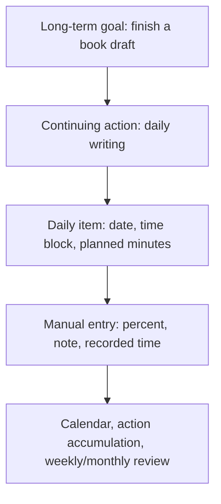
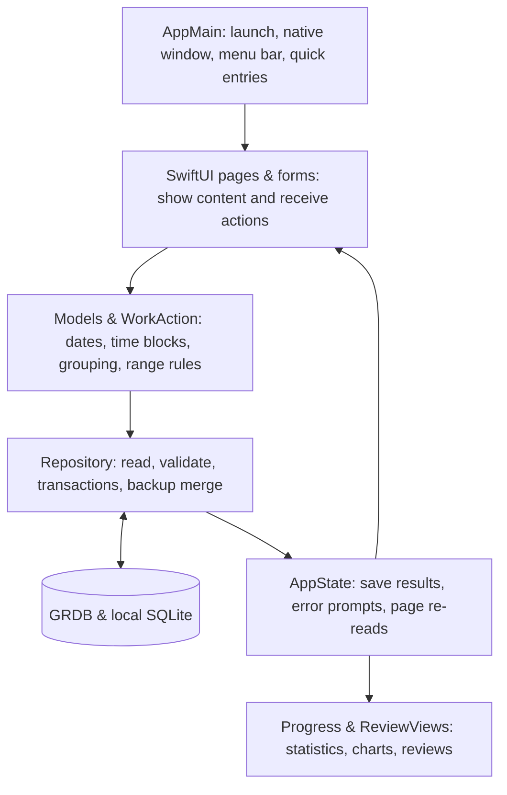

**Contents:**

- [Chinese](README.md)
- [English](README.en.md)
- [Japanese](README.ja.md)

# TimeNote

Turn your day's hourly schedule into visible, long-term progress.

TimeNote is an open-source **native macOS app for planning and recording progress**. You write down long-term goals, break them into daily tasks, log completion manually, and adjust your plan through the calendar, trends, and weekly/monthly reviews.

It is built with **Swift + SwiftUI / AppKit** — not a web wrapper. Daily scheduling, recording, and review do not depend on online services: **no account needed; your work, goals, and progress stay on this machine, with no cloud sync, telemetry, or active uploads.**

> **Current version: 0.1.3 public preview.** It already works for local scheduling, recording, and review, but it is not a finished stable release. **Strict reminders are not yet enabled, and a persistent on-time alarm after sleep or after the app fully quits is not yet implemented or verified — please do not use it as a replacement for an important alarm.**
>
> The project improves reliability through data validation, save-time confirmation, database transactions, and layered testing; these measures are not a claim of "flawless operation" or "never losing data". Verified scope, known warnings, and unfinished items are all documented below.

[Download v0.1.3](https://github.com/Keng0nion/timenote/releases/tag/v0.1.3) · [Release notes](RELEASE_NOTES.md) · [Issue tracker](https://github.com/Keng0nion/timenote/issues) · [MIT license](LICENSE)

## Table of Contents

- [What TimeNote does](#what-timenote-does)
- [Download and installation](#download-and-installation)
- [Core concepts and how it works](#core-concepts-and-how-it-works)
- [Step-by-step guide](#step-by-step-guide)
- [How the statistics are computed](#how-the-statistics-are-computed)
- [How data saving and backup work](#how-data-saving-and-backup-work)
- [How the internal modules fit together](#how-the-internal-modules-fit-together)
- [Technologies and tools used](#technologies-and-tools-used)
- [How reliable operation is guaranteed](#how-reliable-operation-is-guaranteed)
- [Building and checking from source](#building-and-checking-from-source)
- [Current limitations and FAQ](#current-limitations-and-faq)
- [Planned improvements and AI boundaries](#planned-improvements-and-ai-boundaries)
- [Feedback and participation](#feedback-and-participation)
- [License and attribution](#license-and-attribution)

## What TimeNote does

TimeNote focuses on: **what you plan to do today, how much you actually complete, and how those actions accumulate into long-term progress.** It does not judge your goals for you, and it never marks work as done just because the time has passed.

| Feature | Description |
| --- | --- |
| **Schedule explicit time blocks** | Write down date, start time, and end time; planned minutes are computed automatically, including blocks crossing midnight. |
| **Schedule recurring work** | One-time, daily, weekdays, or chosen weekdays; daily items are generated up to a specified end date. |
| **Keep real progress** | Manually enter `0–100%` and notes; every record, correction, and single-step undo keeps the progress history. |
| **Connect long-term goals** | Create work under a goal or attach existing work to it — no duplicated tasks, no double counting. |
| **See recurring work as continuing action** | For example, 30 days of reading shows under the goal as one action, while each day is still recorded separately. |
| **Review your accumulation** | Calendar, completion-rate trend, last-week category review, and last-month overall review; unrecorded days are never treated as failure. |
| **Protect local data** | JSON export, preview before import, numbered-conflict rejection instead of overwriting. |
| **Open quickly** | Menu bar entry, in-app shortcuts, and global shortcuts you configure yourself. |

It is currently **not an actual time tracker, a critical alarm clock, an automatic scheduling assistant, or a multi-device sync tool**.

## Download and installation

### Requirements

- **Chip**: Apple Silicon, i.e. an M-series Mac; Intel is currently not supported.
- **System**: the build target is macOS 14.0 and above. **Actually verified on macOS 26.6.2 and 27.0 / Apple Silicon**; this does not guarantee correct operation on other systems or Macs.
- **Everyday users do not need developer tools**: the download package already includes the app, two third-party runtime libraries, and the required resources; no Python, Swift, database server, or command-line tools are needed.

### Getting the app

Go to the [v0.1.3 macOS Release](https://github.com/Keng0nion/timenote/releases/tag/v0.1.3) and choose one download option:

1. **Recommended DMG**: download `TimeNote-0.1.3-macOS-arm64.dmg`, open it, and drag "时间便签" into "Applications".
2. **ZIP also works**: download `TimeNote-0.1.3-macOS-arm64.zip` and unzip to get the same app; you can also place it in a folder of your choice.
3. `SHA256SUMS.txt` is the checksum list for verifying that your download is complete; it is not another copy of the app.

The first launch shows an empty list: no sample tasks are injected, and no data from other apps is read. The learning/reading examples in this document are operation examples only.

**About the macOS security prompt:** there is currently no Apple developer signing or notarization — only ad-hoc signing. After downloading, macOS may block the app from opening. Ad-hoc signing does not mean Apple has confirmed the developer's identity or completed a security review. Please keep the system prompt and report it; **do not disable Gatekeeper, remove the quarantine attribute, or modify system security policies to bypass the check.**

### Upgrading from an older version

1. In the old version's "Settings & Backup", export a fresh JSON backup.
2. Save or cancel any form you are filling in, then fully quit the old app with `⌘Q`.
3. After replacing the app, open the new one; **never run two copies of TimeNote at the same time**.
4. Verify that your existing work, goals, and history are still there; after tidying goal ownership, export a new backup.

When switching from 0.1 / 0.1.0 / 0.1.1 / 0.1.2 to 0.1.3, the same data location is used — the database does not need to be moved. 0.1.3 does not upgrade the database schema or the native JSON version, and it does not reorganize the older version's loose goal ownership on upgrade.

## Core concepts and how it works

### Four concepts, each solving one problem

- **Long-term goal `Goal`**: what you want to complete over the long term, e.g. "finish a book draft". You name the goal yourself; the app does not auto-break-down or schedule it.
- **Continuing action `WorkAction`**: what you repeatedly do for a goal, e.g. "write daily". It is the aggregated view of one recurring arrangement, **not an extra copied task**.
- **Daily item `WorkItem`**: which day and what time range, e.g. "20:00–20:30 writing on some day". Each day has its own ID, planned duration, goal ownership, and current progress; it can also belong to no goal.
- **Progress entry `Entry`**: how many percent you logged, with what note, and when. One daily item can have multiple progress-history entries.



This diagram shows the order of use, not a requirement to create a goal first: you can also start with a daily list and attach existing work to a goal later.

### Why recurring arrangements are independent per day yet shown as one action

When you create recurring work, the app filters the days matching the rule within the specified date range and **saves the generated daily items in one go**, instead of generating them on the fly each day. Every recurring creation gets a shared `seriesID` — "the ID of this group of recurring arrangements".

- The daily list is read by date, so today and tomorrow each have their own completion status.
- The goal page and "attach existing work" group by `seriesID`, so 30 days of studying and 30 days of reading show as two continuing actions, not 60 rows of dates.
- Grouping is not name-based: creating another recurring arrangement with the same name does not merge them; one-time work without a recurring group is handled independently by its own ID.
- Future work in the same group stays in its original group even if renamed; searching an old name, category, or any member date still matches the whole group.
- Continuing actions are computed from existing daily data; there is no separate "action database table". Future dates outside the specified range are not added automatically, and later same-name series are not pulled in automatically.

### Why goal association never double-counts

A daily item stores one optional `goalID` — "which goal it belongs to". Attaching, switching, or removing through the ownership entry only modifies this field: **no daily items are copied, and dates, times, progress, notes, or progress history are never changed.**

For recurring work, these entries operate on **the whole group of existing dates, including past, today, and future**; one-time work operates on itself only. The original ownership, new ownership, and count are shown first, and saved only after confirmation. Modifying future arrangements follows a separate set of range rules — see below — and the two operations must not be confused.

## Step-by-step guide

### 1. Get to know the four pages

The left navigation contains:

- **Daily list**: view the selected date, add work, record progress, view history, and adjust arrangements.
- **Long-term goals**: add goals, schedule work, attach existing work, and see the accumulation of continuing actions.
- **Accumulation & review**: view calendar, trends, and reviews by month and category; click a calendar day to return to that day's list.
- **Settings & backup**: set shortcuts, import/export, view the data location, review toggles, and license info.

The bottom of the window shows the save status or errors. If you see "save unavailable" or "list refresh failed", handle it as prompted instead of resubmitting repeatedly.

### 2. Add your first item

1. Open "Daily list" and pick a date; use the left/right arrows, or click "Back to today".
2. Click "Add work", or press `⌘N` in the app.
3. Fill in a name, e.g. "read a chapter"; the category is optional, e.g. "Study".
4. Under "what time to what time", enter 24-hour times, e.g. `20:00` to `20:30`.
5. If it happens only once, keep "one-time only"; choose an existing goal if needed.
6. Check the shown "planned 30 minutes" and click "Save arrangement".

**Time input rules:** changing the start time shifts the end time where possible, keeping the last valid duration; the end time can also be changed alone. Unfinished or invalid time blocks cannot be saved. Crossing midnight requires checking "ends next day", e.g. `23:30` to `00:45` next day — planned duration 75 minutes.

Planned minutes are only the time you intend to invest; **this never starts a timer and never sets a system alarm.**

### 3. Schedule recurring work

The add form offers:

- **Every day**: arrange for each day in the range.
- **Weekdays**: Monday to Friday; there is currently no public-holiday / makeup-workday calendar.
- **Chosen weekdays**: e.g. only Tuesday, Thursday, and Saturday.

Then set the "arrange until" end date, check the number of items to be saved, and click "Save arrangement". One date range covers at most 366 days. After saving, each day is recorded separately — completing one day never completes the whole group.

### 4. Record progress, correct, and undo

- **All complete**: click the circle to the left of the work to record `100%`.
- **Partially done or clearly not done**: click "unrecorded / percent", or choose "Record progress…" in "…", enter `0–100`; you can also use the `0% / 25% / 50% / 75% / 100%` buttons, add a note, and click "Save progress".
- **Correct a percentage**: reopen the progress form and enter the correct value. The new record is appended; old records remain viewable.
- **View history**: click "View history…" in "…" to see the original plan, timezone, and every past percent, note, and time.
- **Undo the last manual record**: click "Undo last manual record" in "…". The app appends an "undo" entry and restores the percent from before the last record; undoing the first entry restores "unrecorded". This is not arbitrary multi-step rollback — when the last entry is already an "undo", you cannot undo further.

Future dates cannot be pre-filled with results. Reaching the end time does not auto-complete; a checked item is not unchecked by clicking it again — use the correction or undo entries.

### 5. Modify arrangements that have not started

1. Choose "Modify future arrangement…" from the "…" on the right of the work.
2. Adjust the name, category, time block, or the goal in the form; one-time work can also change its date.
3. For recurring work, you may check "also modify same-group work that has not started and has no records, including this one". Leave it unchecked to modify only the selected one.
4. Click "View change preview" to check the before/after content and the affected dates.
5. Click "Confirm change"; click "Back to edit" or "Cancel" if it is not right.

**Work that has started or has progress history cannot have its arrangement modified**; even after an undo restores it to "unrecorded", the existing history is still protected. The recurring series' date rhythm does not move; past and already-recorded arrangements are not rewritten. Saving re-checks whether the work has started and whether the previewed data has changed.

**Note the scope difference:** this form saves only according to the selected future-modification scope, including the ownership fields in it. To tidy the goal ownership of a whole group across past, today, and future, use the "Attach existing work" or "Attach / adjust long-term goal" entries below.

### 6. Create a goal and turn existing work into a continuing action

**Goal first, then schedule work:**

1. Go to "Long-term goals", click "Add goal", enter a name, and "Save goal".
2. Under that goal, click "Schedule work". The new form already carries this goal — just fill in the date and recurrence.

**Daily work first, then attach to a goal:**

1. Under the goal, click "Attach existing work".
2. Search by name, category, or date; e.g. searching for a specific day still selects the complete recurring group.
3. Pick an action, check the original ownership, new ownership, and whole-group count. When the original ownership has many entries, the preview area scrolls.
4. Click "Attach to goal". Actions already fully owned by this goal do not appear again as candidates; when only some dates belong to this goal, you can still tidy the whole group.

**Switch goals or remove:**

In the daily work's "…", choose "Attach to long-term goal…" or "Adjust long-term goal…", pick another goal, or choose "Not part of a long-term goal", check the preview, and click "Save ownership". Removing only unlinks — **daily work and progress history are never deleted.**

**How 0.1.1's old ownership is handled:** upgrades do not rewrite it automatically. If some dates of a group belong to other goals, the goal page shows the association count; after confirming whole-group tidying via "Attach existing work", those dates also leave the original goal. Only selecting without saving, or pressing Esc to cancel, never changes data.

If any member is added or removed during the selection, or its arrangement, progress, or ownership changes, the whole-group save is rejected. Cancel, reopen, and re-check instead of trying to overwrite new records with an old preview.

### 7. View action accumulation and reviews

- **Inside a goal**: each action shows its date range, time block, completed days to date, and recorded days. Click "Daily records" to jump to today's arrangement; if today has none, it jumps to the nearest later scheduled date, and if none, to the last arrangement.
- **Month calendar**: switch months or pick a category in "Accumulation & review". No plan shows "—", future shows plan only, and only days with records show results.
- **Trend**: each point is the known completion rate of a day. Unrecorded days are left blank — not drawn as `0%` — and gaps are not bridged with fake continuity.
- **Last week / last month**: below the page, the last-week category review and last-month overall review, scrollable. Monday–Sunday is one week; months follow calendar months; both blocks are always computed relative to the current date — they do not follow the month calendar above into arbitrary historical weeks/months.
- **Display toggles**: in settings, choose whether to show the weekly and monthly reviews. They are computed from the latest data when the page opens — not scheduled reports or notifications, and not AI analysis.

### 8. Export and import backups

**Export:** go to "Settings & Backup" → "Export backup…", choose a location. The app exports goals, daily items, and progress history; keep a copy before/after upgrades, ownership tidying, or important changes — do not keep overwriting the only old backup.

**Import:** click "Import backup…" → choose the native JSON → check the added work, added goals, and skipped counts → click "Confirm merge". Canceling the preview writes nothing.

Import is a **merge, not a forced restore-overwrite**: identical content is skipped, new-ID content is merged; same-ID with different content or history rejects the whole batch and keeps existing data. In particular, an old backup from before ownership tidying may conflict because of different goal ownership — it cannot overwrite the new ownership. Detailed rules in [How data saving and backup work](#how-data-saving-and-backup-work).

### 9. Quick entries and safe quitting

- In-app `⌘N` adds work, `⌘,` opens settings, `⌘W` closes the window; Esc cancels forms.
- In settings you can register your own global shortcuts for "Open TimeNote" and "Add work"; by default no combinations are taken, and the two entries cannot share one combination.
- Global shortcuts work only while the app runs; actual cross-app key triggering has not been accepted yet.
- **Closing the window is not quitting**: the menu bar entry remains; choose "Open TimeNote" to show the window again.
- Fully quit with `⌘Q` or the menu bar's "Quit TimeNote". The app's quit action prompts to save or cancel when it detects attached forms; this does not mean unsaved input is protected against system force-quit or power loss.

## How the statistics are computed

### Planned-minute weighting, not a simple average

A 90-minute item and a 30-minute item affect the planned completion rate differently. The algorithm counts only **items with a percentage entered**:

```text
Known completion rate = Σ (recorded work's planned minutes × percent)
                      ÷ Σ (recorded work's planned minutes)

Reading: planned 30 minutes, done 100%
Writing: planned 90 minutes, done 50%

Result = (30 × 100 + 90 × 50) ÷ (30 + 90) = 62.5%
```

If there is also an unrecorded item, its minutes do not enter the denominator of the known completion rate above; they are counted separately as unrecorded count and minutes. Therefore, **"recorded items 100% complete" does not mean all of the day's plan is done** — also check how many items are unrecorded.

- Explicitly entering `0%` is a valid record and participates in weighting; unrecorded means "unknown", not `0%`.
- With no plan for the day, it shows "no plan"; with a plan but nothing filled in, there is no known completion rate.
- Weekly/monthly summaries are computed from each item's planned minutes within the range, not by averaging the daily percentages again.
- Work crossing midnight belongs to its **start day**; future dates do not count toward historical results.
- Planned minutes are not actual timing, and the percentage is not a score of effort, ability, or the whole long-term goal.

The algorithm is in [Progress.swift](Sources/TimeNoteCore/Progress.swift), with percent-range, non-finite-value, and summary-overflow checks.

### Action accumulation counts by day, and the future is not treated as missed

A goal's action accumulation counts only members linked to that goal up to today, by distinct dates:

- **Scheduled days**: the number of dates with an arrangement in the range.
- **Recorded days**: dates where any member entered a percentage, including `0%`.
- **Completed days**: dates where all members of the action are `100%`.

For example, with 30 days of reading scheduled into the future, completing the first one today accumulates one completed day; the 29 days not yet arrived are not treated as missed. While an older partially-linked group is not yet tidied, the goal page shows only the accumulation of the linked part and notes its share of the whole group.

These day counts answer "how long have I kept going"; planned-minute weighting answers "to what degree is the recorded work done". They have different purposes, and the app **does not derive an overall long-term goal completion rate from them**.

## How data saving and backup work

### Where the data lives on this machine

The release app uses the system's application support directory:

```text
~/Library/Application Support/TimeNoteNative-v1/
```

The main file is `timenote.sqlite` — a local SQLite database; no separate database server is needed. At runtime there may also be auxiliary files like `timenote.sqlite-wal` and `timenote.sqlite-shm`.

- In "Settings & Backup", click "View data in Finder" to locate the directory.
- **Do not copy only the main file as a backup while the app runs** — this may miss content still in the auxiliary files; prefer the app's export.
- Moving the app does not move the records, and deleting the app does not automatically clean up the data. Do not treat deleting the data directory as a reinstall step.
- If the database cannot be opened, the app reports an error and disables saving; it never auto-empties or replaces the original file just to show an empty list.

### How the database is organized

[Repository.swift](Sources/TimeNoteNative/Repository.swift) manages three tables via GRDB:

- `goal`: goal IDs and names.
- `work`: daily items, including recurring-group ID, goal ID, date, start time, planned minutes, timezone, and current percent.
- `entry`: progress history, including linked work ID, percent, note, recorded moment, and "record / undo" type.

IDs distinguish objects, and database association constraints prevent records from pointing to nonexistent goals or work. Schema changes are managed by migrations; **0.1.3 still uses `v1-local-history`, with no new action table and no silent rewrite of old ownership.**

When progress is saved, appending the history and updating the current percent happen in the same database transaction. A "transaction" means **a group of operations either all succeed or all roll back**, avoiding saving only half. Whole-group ownership changes and backup merging also use transactions.

### What the JSON backup contains and rejects

The native backup format is `timenote-native`, version `1`, containing `goals`, `tasks`, `entries`. Export collects content from a single database read and saves the file with an atomic write, reducing the risk of leaving an incomplete file if the write is interrupted.

The backup **does not contain the app itself, global shortcuts, or review display toggles**, and it is not a backup of the whole macOS user directory.

The import flow is:

1. **Check format and size first**: unsupported versions, oversized files, or invalid JSON are rejected.
2. **Then check content relations**: whether IDs are valid and duplicate, percents and time blocks valid, goals and work exist, and whether the work's current progress matches its last history entry.
3. **Compare with existing data**: identical content is skipped; new-ID content is merged; same-ID differences reject the whole import.
4. **Let you confirm the preview**: added and skipped counts are shown.
5. **Re-validate and save the whole batch on confirm**: to avoid overwrites from data changes after the preview; errors in the middle roll back.

The first-version import file limit is the **20MB** stated in the UI; the code actually limits to `20 × 1024 × 1024` bytes; at most 20000 work items, 2000 goals, and 200000 history entries. Dates support 2000–2100, a single recurring date range covers at most 366 days, and a single time block is 1–1440 minutes. These are format and operation limits, **not a promise that these scales have passed stress tests**.

The early web demo's JSON is incompatible with the native format — keep the original file; do not change IDs or the version number to force an import.

### Privacy and safekeeping

- The app has no account, telemetry, active uploads, cloud sync, or online AI.
- **The database and exported JSON have no extra encryption by this software**; keep them like private documents; do not upload them to public issues or repositories.
- If you save backups to a cloud drive yourself, that drive's own sync and access control are outside this software's control.
- Manual backups, OS security, and disk health still matter; transactions cannot replace backups or guarantee recovery after disk failure.

## How the internal modules fit together

The software separates "show the UI", "apply the rules", and "save the data", so the same rules can serve both the real UI and local data checks.



The diagram shows main responsibilities and data flow, not that every arrow is a separate process or a strictly one-way call. Concrete entry points:

- [AppMain.swift](Sources/TimeNoteNative/AppMain.swift): app launch, window lifecycle, menu and shortcut wiring; the release data directory and test entries are distinguished at compile time.
- [Views.swift](Sources/TimeNoteNative/Views.swift): daily list, progress entry, history view, and form entries.
- [AppState.swift](Sources/TimeNoteNative/AppState.swift): page state, post-save refresh, error prompts, system import/export dialogs.
- [Models.swift](Sources/TimeNoteNative/Models.swift): data definitions and validation for dates, time blocks, recurring arrangements, work, goals, history, and backups.
- [PlanEditor.swift](Sources/TimeNoteNative/PlanEditor.swift): adding work, and the "compare first, then confirm" future modification.
- [WorkAction.swift](Sources/TimeNoteNative/WorkAction.swift): grouping by recurring series, whole-group search, action day counts, and jump dates.
- [GoalAssignment.swift](Sources/TimeNoteNative/GoalAssignment.swift): attaching existing work, adjusting ownership, full old-ownership preview.
- [Repository.swift](Sources/TimeNoteNative/Repository.swift): database migration, read/write, history, transactions, stale-preview protection, and backup merging.
- [ReviewViews.swift](Sources/TimeNoteNative/ReviewViews.swift): goal action list, calendar, trends, and weekly/monthly reviews.
- [SettingsView.swift](Sources/TimeNoteNative/SettingsView.swift): shortcut registration, review toggles, backup entries, and license info.
- [Progress.swift](Sources/TimeNoteCore/Progress.swift): the standalone planned-minute weighting calculation.

## Technologies and tools used

**"Technologies the app uses at runtime" and "tools the developer uses to build, check, and release" are two different things.** Everyday users only need the app package; there is no need to install all the tools below.

### Technologies the app itself uses

- **Swift 6**: the main programming language, used to express work, progress, and saving rules. Types and compile checks catch some errors early, but do not automatically eliminate all runtime problems.
- **SwiftUI**: Apple's native UI framework, for lists, forms, navigation, and light/dark appearance. Pages update with state; no browser engine is involved.
- **AppKit**: provides macOS windows, menu bar, app menu, keyboard entries, file dialogs, and Finder locating — desktop capabilities combined with SwiftUI.
- **Foundation**: handles dates, calendars, timezones, files, UUID IDs, and JSON coding; e.g. rejecting nonexistent dates and start times removed by daylight saving time.
- **Swift Charts**: Apple's system chart framework, drawing the daily completion-rate trend. Chart data comes from local records; no online chart service is requested.
- **SQLite + [GRDB.swift 7.11.1](https://github.com/groue/GRDB.swift)**: SQLite is an embedded local database; GRDB provides Swift read/write, migration, transactions, and record mapping, reducing repeated low-level database code. **Integrated; GRDB uses the MIT license.**
- **[KeyboardShortcuts 3.0.1](https://github.com/sindresorhus/KeyboardShortcuts)**: provides global shortcut registration, wired to opening the window and adding work. **Integrated, MIT license**; works only while the app runs; cross-app triggering is still pending acceptance.
- **`@AppStorage` / UserDefaults**: the system's small preferences store, used for the two review display toggles; work and history are not stored here — they go into SQLite.

### Build and dependency management tools

- **Python 3 + [build.py](build.py)**: chains local compilation, dependency library compilation, test packages, and release `.app` packaging. The script does not install developer tools.
- **Apple command-line developer tools, macOS SDK, `xcrun`, and `swiftc`**: locate the existing compiler and system frameworks and compile Swift sources into Apple Silicon programs. Direct compilation is used; SwiftPM is not required, and no sources outside the repository are depended on.
- **[fetch_dependencies.py](fetch_dependencies.py) + [dependencies.json](dependencies.json)**: downloads pinned-version sources from two official GitHub projects, verifies the downloaded archives' SHA-256, and saves to `Vendor/`. Only ordinary files and directories are extracted; upstream scripts are never executed; a matching cache is reused, which does not mean re-downloading every time or verifying the cache file by file.
- **[Tools/Icon.swift](Tools/Icon.swift) + `iconutil`**: draws icons at different sizes with local AppKit and generates the macOS `.icns` icon resource; no online icon service.

When compiling KeyboardShortcuts directly, the script generates a compatible copy in `.build-local/`: expanding `@Entry`, removing the dev-preview-only `#Preview`, and adding the resource bundle entry. **The original `Vendor/` sources are not modified**, and localized resources are kept; this adaptation is not confirmed upstream and does not mean the upstream suite fully passes. See the [third-party notes](Resources/第三方说明.txt).

### Testing, packaging, and release tools

- **Directly compiled Swift check programs**: verify planning, statistics, history, whole-group operations, backups, and failure rollback in a separate test database; real work is never used as test data.
- **Python standard library `unittest`**: runs [ReleaseChecks.py](Tests/ReleaseChecks.py), checking public-source independence, version, path protection, documentation, and licenses.
- **Native window check program**: compiled only in the dedicated test package; dispatches keyboard and native control actions to this app's windows with fictional data and checks pages and save results. It does not request Accessibility permission — this is not a full system-level UI test.
- **`codesign`**: ad-hoc signs the generated app and two dynamic libraries and checks signature integrity. **Not Apple developer signing, not notarization, and not a proof of no vulnerabilities.**
- **`hdiutil`**: creates, mounts, and checks the DMG image, verifying the app users actually download.
- **SHA-256 and byte-by-byte comparison**: checks that packages, files inside them, and assets re-downloaded from GitHub match the to-be-released content; consistency is not functional correctness or trustworthiness.
- **Git + GitHub CLI `gh`**: records source versions, pushes the public repository, uploads the preview Release, and re-downloads to verify. They are development/release tools, not app runtime dependencies.

`build.py app` only generates the `.app`; it **does not automatically produce all Release assets, upload to GitHub, or run cloud checks**. DMG/ZIP release and re-download acceptance are separate release steps.

### Which tools are not integrated

- [Defaults](https://github.com/sindresorhus/Defaults) was only an evaluated candidate — **not downloaded, not integrated**; the two review toggles use system storage to avoid adding another settings layer.
- No Sparkle auto-update, AI models, cloud sync, background reminder components, or online analysis services are integrated.
- SwiftUI, AppKit, Foundation, and Swift Charts are Apple system frameworks and should not be listed as third-party open-source libraries introduced by the project.

Both integrated third-party dependencies keep the full MIT text: [GRDB license](Resources/GRDB-LICENSE.txt) and [KeyboardShortcuts license](Resources/KeyboardShortcuts-LICENSE.txt), shipped with the app.

## How reliable operation is guaranteed

### Protection measures already implemented

1. **Validate input first**: name length, valid dates, recurring range, time blocks, and percentages are checked before saving; invalid data never sneaks through by the UI just showing "success".
2. **Confirm important changes first**: future arrangements show a change preview first; goal ownership shows the whole-group scope first; backups show a merge preview first.
3. **Check again at save time**: whole-group ownership re-reads all members inside the transaction and compares with the snapshot taken at selection; if members or work content changed, the old preview is rejected, avoiding overwriting newer arrangements, progress, and ownership.
4. **Multiple writes use transactions**: recurring creation, progress & history writes, future modification, whole-group ownership, and backup merging all avoid leaving half-updates.
5. **Progress history is append-only**: corrections and single-step undo never erase old progress records; arrangements that started or have history cannot be freely rewritten.
6. **Errors are stated clearly**: if data cannot be opened, the original file is kept and saving is disabled; if a write succeeded but refresh failed, it explicitly says "do not resubmit" instead of misreporting a save failure.
7. **Tests and real data are separate**: window checks compile only into the test package; the release package contains no `--data-dir` / `--smoke-test` test entries.
8. **Pinned dependencies and checked release content**: pinned versions are downloaded, archives verified, licenses kept, compile paths mapped, and the unpacked and mounted app checked — not just files in the dev directory.

### What was actually verified at the 0.1.2 release

The following are **the existing verification results of 0.1.2 in this machine's environment**; they are not re-run for every documentation update and do not mean all machines, inputs, and long-term use passed.

- **117 data checks passed**: `python3 build.py test`, keeping the original 74 and adding 43, covering time & recurrence rules, the 62.5% weighting, history append & undo, future protection, backup round-trip, conflict rejection, same-name different-group, whole-group attach / switch / remove, member changes, and database reopen.
- **Real mid-flight failure rollback passed**: the test database set an SQL trigger to interrupt later writes after the first item of a group was actually written, confirming all ownership and records were restored with no half-group results; not merely checking that an error could be raised before saving.
- **5 public release checks passed**: `python3 -B Tests/ReleaseChecks.py`, checking source independence, public version, compile-path protection, continuing-action documentation, MIT dual attribution, and the bundled license entry.
- **Release and test packages built successfully**: `python3 build.py app`, `python3 build.py ui-app`; business sources compile with warnings-as-errors.
- **Two rounds of native window checks**: 1100×780 light and 940×690 dark, **27 checkpoints passed per round, 19 fictional-data screenshots saved**. Covering add, cancel, progress, change preview, 60 arrangements grouped into two actions, partial ownership, whole-group attach and goal switch, long-name six-old-ownership scrolling, post-preview refresh still rejecting newer progress, and reopen consistency.
- **Release file checks passed**: strict ad-hoc signature checks on the app after ZIP unzip and DMG mount; SHA-256 and permission verification of 29 files inside the package; arm64 architecture checks on the main program and two dynamic libraries; three license checks.
- **GitHub re-download verification passed**: ZIP, DMG, and checksum list matched the uploaded content byte-for-byte; the re-downloaded DMG again passed the strict integrity check.

Test sources: [NativeChecks.swift](Tests/NativeChecks.swift), [ActionChecks.swift](Tests/ActionChecks.swift), [NativeUI.swift](Tests/NativeUI.swift), and [ReleaseChecks.py](Tests/ReleaseChecks.py). Screenshots are for local fictional-data checks only, not user data.

### Remaining verification boundaries and warnings

- The actual environment is **macOS 26.6.2 / Apple Silicon / Swift 6.3.3**; macOS 14.0 is the compile target, not a tested minimum system.
- The 117 checks are directly compiled Swift data checks, **not standard XCTest**, and do not replace the two dependencies' upstream test suites. The standard SwiftPM/XCTest path on this machine currently has interface compatibility problems; this repository uses the direct-compilation approach.
- GRDB direct compilation keeps two upstream `Any`/`Sendable` warnings. Both window-check rounds still had **9 SwiftUI `AttributeGraph` layout-loop warnings each**; the history check also saw system input-method logs. Passing checks does not mean a warning-free log.
- This window event check cannot replace full system-level operation. The complete keyboard/mouse flow of the system backup file dialog and cross-app global shortcut triggering have not been accepted.
- File providers may auto-add Finder metadata to `.app` files in the working directory, causing strict signature check anomalies. Therefore release does a separate post-unzip/mount strict verification; a plain signature check cannot replace it.
- Other Macs / system versions, cross-timezone long-term use, long-running and stress scenarios, and reminders after sleep or full quit still cannot be guaranteed.

## Building and checking from source

### Preparing the environment

You need an Apple Silicon Mac, existing Apple command-line developer tools and macOS SDK, a toolchain/SDK combination that can compile `@State` property wrappers, and Python 3. The scripts do not install software, change system settings, or request background permissions for you.

The Command Line Tools (Swift 6.4) default SDK implements `@State` as an external macro, but the tools do not include its plugin; compilation fails without the plugin. Before building, point `SDKROOT` at an SDK that still implements `@State` as a normal property wrapper (`MacOSX26.5.sdk` on this machine).

After obtaining the sources, run in the repository root, in order:

```sh
export SDKROOT="/Library/Developer/CommandLineTools/SDKs/MacOSX26.5.sdk"
python3 fetch_dependencies.py
python3 -B Tests/ReleaseChecks.py
python3 build.py test
python3 build.py app
```

What each step does:

1. `fetch_dependencies.py`: fetch the two locked official dependencies. **This step may download sources from the network, but it never uploads your sources or user data.**
2. `ReleaseChecks.py`: first checks the public repository, release notes, compile paths, and licenses.
3. `build.py test`: compiles the dependencies and data check programs, creates a separate test directory under `.build-local/test-data/`, and runs the checks there without reading the real work database.
4. `build.py app`: compiles the release app, adds dynamic libraries and resources, adds the three licenses, ad-hoc signs, and outputs `dist/时间便签.app`.

With the dependencies in place, building and checking run on this machine. Compilation maps source paths to `/timenote` so the released binary does not expose the builder's personal directory.

**Note: a release package you build yourself also reads the normal data directory — it is not a test sandbox.** Do not treat opening a self-built release package as isolated testing, and do not run the old and new versions at the same time.

### Optional checks and icon generation

```sh
python3 build.py ui-app
python3 build.py icon
```

- `ui-app` outputs `dist/时间便签测试.app` — build only; it does not start window checks automatically. Running this dedicated test package requires both `--data-dir` and `--smoke-test`; the data directory must be an absolute path and stay an empty list; use a fresh independent empty directory per round — **never point it at the real data directory**.
- The test package can take `--dark --small` for a dark small window. Window checks open this app's windows, write fictional work and backups, save screenshots, and quit automatically; no Accessibility permission is requested, and global shortcuts are not tested.
- `icon` uses `Tools/Icon.swift` and the system `iconutil` to rebuild `Resources/TimeNote.icns`, updating the icon file in the repository; normal builds can already use the icon shipped with the sources, so there is no need to rebuild every time.

### Directory navigation

```text
Sources/
  TimeNoteCore/       planned-minute weighting and other base calculations
  TimeNoteNative/     macOS UI, rules, state, and database operations
Tests/               data, window, and public release checks
Resources/           app info, icons, and third-party license notes
Tools/               local icon generation and standalone reminder verification tools
build.py             direct compilation, tests, and app packaging
fetch_dependencies.py  pinned-version dependency download
dependencies.json    dependency versions, download URLs, and archive checksums
LICENSE              main project MIT license
RELEASE_NOTES.md      version changes and release notes
```

`Vendor/` is the downloaded upstream sources, `.build-local/` is build and test output, and `dist/` is the generated app. These directories, along with databases, logs, screenshots, and installers, never enter the source Git commits — see [.gitignore](.gitignore); the downloadable release installers are placed separately on GitHub Releases.

## Current limitations and FAQ

### Why is there no alarm bell at the time, and no auto-completion?

Currently the time fields are used for scheduling and computing planned duration; no system alarm is created, and completion must be recorded manually. **A persistent on-time alarm after sleep or after the app fully quits is not yet implemented or verified**; no background registration, login item, power wake, or notification permission is registered, and ordinary notifications are not used to fake a strict alarm.

### Why can't I modify past times, or cancel / archive an item?

Arrangements with history or that have started are protected, to avoid changing the original plan after the fact. You can correct progress, append notes, or use the ownership entries to adjust goals; **cancel / archive is not yet implemented** — do not edit the database directly to bypass the limits.

### Why does it show a high completion rate with many unrecorded items?

The completion rate only describes the recorded part; unrecorded is unknown and does not enter the known completion rate's denominator. Check the unrecorded count as well. The app never treats unknown as failure, nor claims the whole day is done because of it.

### Why does importing an old backup report a conflict?

When the same ID already has different progress, history, or ownership, the import refuses to overwrite. This is data protection, not an "automatically restore from an old backup" tool. Keep both files; do not change IDs, delete the existing database, or repeatedly attempt a forced merge.

### Can I use it on another Mac? Is there auto-sync or auto-update?

It can be installed on another qualifying Mac, with manual export / import of compatible native backups; **cross-machine use has not been actually accepted, and conflict rules still apply**. There is no cloud sync, online account, or auto-update; updating means downloading the new version yourself and following the upgrade steps.

### What is still not done?

- Strict reminders and the persistent alarm after sleep / full quit.
- Cancel / archive work, renaming long-term goals.
- Early web demo backup migration.
- Local or online AI, automatic scheduling, cloud sync, auto-update.
- Custom review generation date/time and scheduled notifications.
- Intel support, Apple developer signing and notarization, and full cross-machine / cross-system acceptance.

These are currently missing or unverified capabilities, not promises with a scheduled release date. The latest version changes are governed by the [Release](https://github.com/Keng0nion/timenote/releases) page and the [release notes](RELEASE_NOTES.md).

## Planned improvements and AI boundaries

The plan is to solidify basic use first, then add smart features; **the following is the order of advancement — not delivered features, and no promise of release dates for unverified capabilities.**

1. **Verify reminder reliability first**: audible ringing with manual stop first, then verify snooze, full app quit, lock screen, and sleep with lid closed on power. Notifications, sleep prevention, or catch-up ringing after wake cannot replace the strict requirement. The standalone [reminder verification tool](Tools/AlarmProbe/README.md) has completed silent checks and two separately authorized awake sound trials: the first had a human-heard and stop record, but the ~11 s time to a successful play request was not localized and ended in an external timeout; the second observed ~0.566 s to successful playback and a normal exit, with the operator confirming afterwards that it was heard and the sound repeated until manually stopped. This standalone tool's ringing, repeat-until-manual-stop, and normal exit have evidence, but the app's timing and the afterwards feedback are not a precise first-sound measurement. The second trial not reproducing the long duration does not mean the first problem is fixed; punctuality and the full reminder chain are still not accepted, **stage one has not passed**. Later silent investigation confirmed both timings of the first trial recorded long intervals, but the old logs lack segmentation and the cause still cannot be localized; the verification tool's audio preparation also occupies the window execution path, so an independent external timeout guard is kept — callback tolerance cannot be treated as a first-sound guarantee. The tool does not run in the release app, so this cannot justify enabling release reminders; there is no automatic retry.
2. **Shorten the steps to create and start work**: check the home page, quick entries, and time defaults to reduce repeated input and page switching, accepted by actual operation; never equate starting work with auto-completion or inferred progress.
3. **Improve continuing use after interruptions**: after a failed save, reopen, or day change, make it clear what to do next, with no lost input and no changed history; how unfinished work is handled is never silently decided by the system.
4. **Get recovery and backup right**: not just testing the JSON algorithm, but walking through actual export, save, reopen, and restore; conflicts and failures never overwrite existing data.
5. **Then add moderate review**: weekly categories, monthly overall, missing data listed separately; first make it readable and not intrusive, and never conclude from insufficient data.
6. **AI only after basic features and convenience are accepted**: support proposing schedules automatically, and local AI calling the app through a controlled entry. Rule suggestions, a real local model, and optional online services are labeled separately and never mixed.

### What AI can do, and what still needs confirmation

**There is currently no callable AI interface and no automatic scheduling implementation; do not ask a model to modify SQLite or JSON directly to bypass the app's validation.** Later, two directions are distinguished: "the app requests a local model to generate a plan" and "external local AI calls the app"; protocol, model, and download requirements are not yet chosen.

- Scheduling first shows the proposed new/modified future arrangements and differences, saved only after you confirm; history and started or in-progress work are never silently changed.
- App settings in stage one provide suggestions only, never written directly by AI; an open-source tool being callable does not mean arbitrary system permissions.
- When the model is unavailable, it says so honestly and never silently switches to online processing; online services are enabled separately after explaining the data sent, keys, cost, and privacy.
- On integration, a complete executable README guide is added: environment prep, enable/disable, read examples, write examples needing confirmation, errors and cancellation, repeated-request protection, and recovery. API addresses, commands, or available models are never invented in advance.

## Feedback and participation

Welcome to submit issues or suggestions via [Issues](https://github.com/Keng0nion/timenote/issues). To make reproduction easier, please state:

1. TimeNote version, macOS version, and chip type.
2. Which page you started from and what you did in order.
3. Expected result, actual result, and the full error message.
4. Whether it can be reproduced with fresh fictional work.

**Before attaching screenshots, cover private work content and personal data paths; do not publicly upload databases, JSON backups, credentials, or personal plans.** Prefer fictional content to describe the problem.

When improving the source, also check the related data rules, necessary tests, and usage documentation; never remove history protection, skip import conflicts, or weaken reminder boundaries to make tests go green.

## License and attribution

TimeNote uses the **[MIT license](LICENSE)**.

**Copyright (c) 2026 Kengo Kubota and Keng0nion**

Modification, commercial use, and distribution (including closed-source versions) are allowed, provided the copyright and license notices are kept; the software is provided as-is, without warranty. The Chinese explanation above does not replace the English license text.

The full terms can be viewed in the app under "Settings & Backup → TimeNote MIT license". GRDB.swift and KeyboardShortcuts keep their own original MIT text and copyright attribution, not replaced by the main project's copyright notice.
