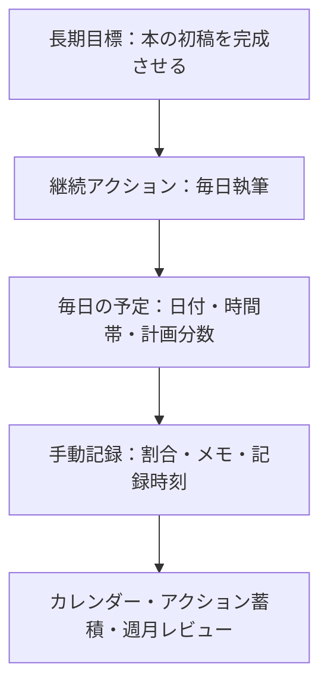
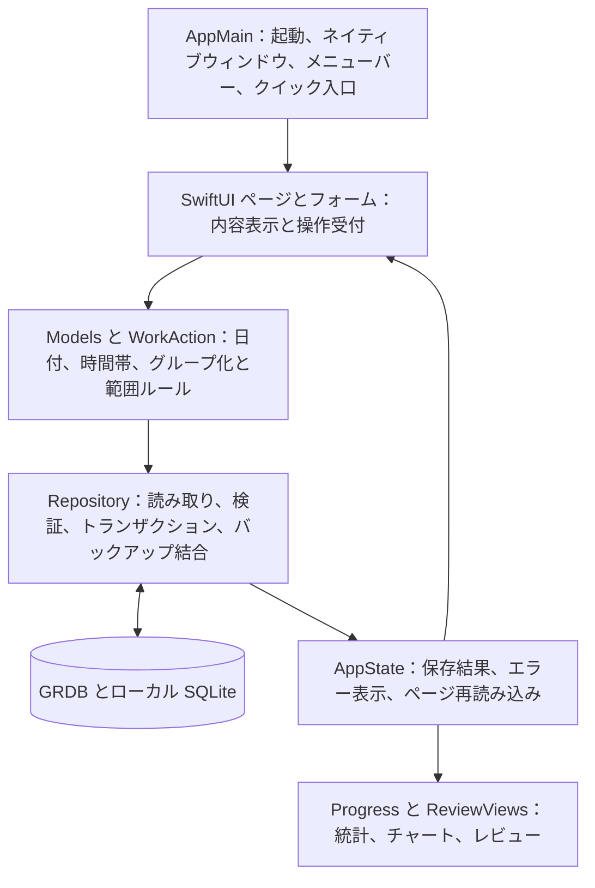

**目次：**

- [中国語](README.md)
- [英語](README.en.md)
- [日本語](README.ja.md)

# 時間メモ（TimeNote）

毎日の時間割を、目に見える長期的な積み重ねに変える。

時間メモはオープンソースの **macOS ネイティブの予定・進捗記録アプリ**です。長期目標を書き出し、それを毎日の作業に分解し、完了度を手動で記録して、カレンダー・トレンド・週次／月次レビューで計画を調整できます。

**Swift + SwiftUI / AppKit** で開発されており、ウェブ外殻ではありません。日常の予定・記録・レビューはオンラインサービスに依存しません。**アカウントは不要で、作業・目標・進捗はこの Mac 内に保存されます。クラウド同期、テレメトリ、能動的なアップロードはありません。**

> **現在のバージョン：0.1.3 公開プレビュー版。** ローカルでの予定・記録・レビューには既に使えますが、すべての機能が完成した安定版ではありません。**厳密なリマインダーはまだ有効化されておらず、スリープ中やアプリ完全終了後の定時連続鳴動は未実装・未検証です。重要なアラームの代わりには使わないでください。**
>
> プロジェクトは、データ検証、保存前確認、データベーストランザクション、層状テストによって信頼性を高めています。これらの措置は「完璧な動作」や「データ喪失なし」の保証ではありません。検証済み範囲、既知の警告、未完了事項は下文で説明します。

[v0.1.3 をダウンロード](https://github.com/Keng0nion/timenote/releases/tag/v0.1.3) · [リリースノート](RELEASE_NOTES.md) · [問題報告](https://github.com/Keng0nion/timenote/issues) · [MIT ライセンス](LICENSE)

## 目次

- [TimeNote がすること](#timenote-がすること)
- [ダウンロードとインストール](#ダウンロードとインストール)
- [コア概念と動作の仕組み](#コア概念と動作の仕組み)
- [詳細操作ガイド](#詳細操作ガイド)
- [統計の計算方法](#統計の計算方法)
- [データ保存とバックアップの仕組み](#データ保存とバックアップの仕組み)
- [内部モジュールの連携](#内部モジュールの連携)
- [使用している技術とツール](#使用している技術とツール)
- [信頼性の担保](#信頼性の担保)
- [ソースからのビルドと検査](#ソースからのビルドと検査)
- [現在の制限と FAQ](#現在の制限と-faq)
- [今後の改善順序と AI の境界](#今後の改善順序と-ai-の境界)
- [フィードバックと参加](#フィードバックと参加)
- [ライセンスと署名](#ライセンスと署名)

## TimeNote がすること

時間メモが注目するのは：**今日何をする予定か、実際にどれだけ完了したか、その行動がどう長期的な進捗に積み重なるか。** 目標を自動で判断することも、時間が過ぎたからといって作業を完了扱いにすることもありません。

| 機能 | 説明 |
| --- | --- |
| **明確な時間帯を予定する** | 日付・開始時刻・終了時刻を書き込むと計画分数を自動計算。深夜またぎにも対応。 |
| **繰り返し作業を予定する** | 1 回だけ・毎日・平日・自選曜日に対応し、指定終了日まで毎日の予定を生成。 |
| **実際の進捗を残す** | `0–100%` とメモを手動入力。記録・修正・1 ステップ取り消しのたびに進捗履歴を保持。 |
| **長期目標とつなげる** | 目標の下に作業を新規作成することも、既存の作業を追加することもできる。タスクの複製・二重計上なし。 |
| **繰り返し作業を継続アクションとして見る** | 例：30 日の読書は目標の下に 1 つのアクションとして表示され、毎日は独立して記録される。 |
| **蓄積を振り返る** | カレンダー、完了率トレンド、先週のカテゴリレビュー、先月の全体レビュー。未記録は失敗扱いにしない。 |
| **ローカルデータを守る** | JSON 書き出し、読み込み前プレビュー、番号衝突時は上書きせず拒否。 |
| **すばやく開く** | メニューバー入口、アプリ内ショートカット、自分で設定するグローバルショートカット。 |

現在は**実際の計時タイマー、重要なアラーム時計、自動スケジュール助手、複数デバイス同期ツールではありません**。

## ダウンロードとインストール

### 実行要件

- **チップ**：Apple Silicon（M シリーズ Mac）。Intel は現在未対応。
- **システム**：ビルドターゲットは macOS 14.0 以上。**macOS 26.6.2 と 27.0 / Apple Silicon で実検証済み**。その他のシステム・他の Mac での正常動作を保証するものではありません。
- **一般ユーザーは開発ツール不要**：ダウンロードパッケージにはアプリ、2 つのサードパーティ実行ライブラリ、必要なリソースが同梱。Python、Swift、データベースサーバー、コマンドラインツールの追加インストールは不要。

### アプリの入手

[v0.1.3 macOS Release](https://github.com/Keng0nion/timenote/releases/tag/v0.1.3) にアクセスし、ダウンロード方法を選択：

1. **推奨 DMG**：`TimeNote-0.1.3-macOS-arm64.dmg` をダウンロードして開き、「時間便签」を「アプリケーション」にドラッグ。
2. **ZIP も可**：`TimeNote-0.1.3-macOS-arm64.zip` をダウンロード・解凍すると同じアプリが得られる。好きなフォルダに置いてもよい。
3. `SHA256SUMS.txt` はダウンロードの完全性を照合するチェックサム一覧であり、別のアプリではない。

初回起動は空リスト。サンプル作業を注入せず、他のソフトのデータも読まない。本文中の学習・読書などは操作例にすぎない。

**macOS のセキュリティ警告について：** 現在 Apple の開発者署名・公証はなく、ad-hoc 署名のみ。ダウンロード後、macOS が起動をブロックする場合がある。ad-hoc 署名は、Apple が開発者本人を確認しセキュリティ審査を完了したことを意味しない。システム警告を残して報告してください。**Gatekeeper を無効化したり、隔離属性を外したり、システムのセキュリティポリシーを変更して検査を迂回しないでください。**

### 旧バージョンからのアップグレード

1. 旧版の「設定とバックアップ」で最新の JSON バックアップを書き出す。
2. 入力中のフォームを保存またはキャンセルし、`⌘Q` で旧アプリを完全終了。
3. アプリを入れ替えて新版を開く。**2 つの時間メモを同時に実行しない。**
4. 既存の作業・目標・履歴が残っていることを確認し、目標の帰属を整理してから新しいバックアップを書き出す。

0.1 / 0.1.0 / 0.1.1 / 0.1.2 から 0.1.3 へは同じデータ位置を使うため、データベースを移動する必要はありません。0.1.3 はデータベース構造やネイティブ JSON バージョンを更新せず、アップグレード時に旧版の散らかった目標帰属を勝手に整理することもありません。

## コア概念と動作の仕組み

### 4 つの概念、それぞれが 1 つの問題を解決

- **長期目標 `Goal`**：長期的に完了したいこと。例：「本の初稿を完成させる」。目標名は自分で入力し、ソフトが自動で分解・予定することはありません。
- **継続アクション `WorkAction`**：目標のために繰り返し行うこと。例：「毎日執筆」。同じ繰り返し予定の集約表示であり、**複製された追加タスクではありません**。
- **毎日の予定 `WorkItem`**：具体的にどの日・何時から何時まで行うか。例：「某日 20:00–20:30 執筆」。毎日が独自の番号・計画時間・目標帰属・現在の進捗を持ち、どの目標にも属さないこともできます。
- **進捗記録 `Entry`**：今回入力した割合・メモ・記録時刻。1 つの毎日の予定に複数の進捗履歴を持てます。



この図は使用順序を示すものであり、必ずしも先に目標を作ることを求めるものではありません：先に毎日のリストを使い、後から既存の作業を目標に追加することもできます。

### 繰り返し予定が毎日独立なのに 1 つのアクションしか表示されない理由

繰り返し作業を作成すると、ソフトは指定日範囲内でルールに合う日を筛选し、**排出済みの毎日の予定を一括保存**します。当日になって臨時生成するのではありません。繰り返し作成のたびに共通の `seriesID`（この繰り返しグループの番号）が付与されます。

- 毎日のリストは日付で読むため、今日と明日はそれぞれの完了状況を持ちます。
- 目標ページと「既存作業を追加」は `seriesID` でグループ化するため、30 日の学習と 30 日の読書は 2 つの継続アクションとして表示され、60 行の日付にはなりません。
- グループ化は名前だけでは判断しません：同名の別の繰り返し予定を作成しても誤って統合されません。繰り返しグループのない単発作業は自分の番号で独立処理されます。
- 同グループの未来の作業は、名前を変えても元のグループに属し続けます。旧名・カテゴリ・メンバーの日付で検索しても、マッチするのはグループ全体です。
- 継続アクションは既存の毎日のデータから計算され、独立した「アクション用データベーステーブル」はありません。指定範囲外の未来日付が自動追加されることも、後から作った同名シリーズが自動的に取り込まれることもありません。

### 目標の関連付けが二重計上にならない理由

毎日の予定はオプションの `goalID`（どの目標に属するか）を 1 つだけ保存します。帰属調整入口で追加・変更・除外する際はこのフィールドだけを変更します。**毎日の予定を複製せず、日付・時刻・進捗・メモ・進捗履歴を変更しません。**

繰り返し作業の場合、これらの入口は**過去・今日・未来を含むグループ全体の既存日付**を処理します。単発作業は自分自身のみ処理します。元の帰属・新しい帰属・回数を先に表示し、確認後に保存します。未来の予定の変更には別の一連の範囲ルールがあり（下文参照）、両者を混同してはいけません。

## 詳細操作ガイド

### 1. 4 つのページを知る

左側のナビゲーション：

- **毎日のリスト**：選択日を表示、作業を追加、進捗を記録、履歴を見る、予定を調整。
- **長期目標**：目標を追加、作業を予定、既存作業を追加、継続アクションの蓄積を確認。
- **蓄積とレビュー**：月別・カテゴリ別にカレンダー・トレンド・レビューを表示。カレンダーの日をクリックするとその日のリストへ戻る。
- **設定とバックアップ**：ショートカット設定、読み書き出し、データ位置、レビュー表示切替、ライセンス表示。

ウィンドウ下部には保存状態やエラーが表示されます。「保存不可」「リスト更新失敗」などの表示が出たら、連続して再送信するのではなく、表示に従って対処してください。

### 2. 最初の作業を追加する

1. 「毎日のリスト」を開き、日付を選択。左右矢印で切り替えたり「今日に戻る」をクリックしたりできます。
2. 「作業を追加」をクリック、またはアプリ内で `⌘N`。
3. 名前を入力。例：「一章を読む」。カテゴリは任意、「学習」などでも可。
4. 「毎日何時から何時まで」に 24 時間制で入力。例：`20:00` ～ `20:30`。
5. 1 回だけなら「1 回だけ」のまま。必要なら既存の帰属目標を選択。
6. 表示される「計画 30 分」を確認し、「予定を保存」をクリック。

**時刻入力ルール：** 開始時刻を変更すると、前回の有効な時間を保つよう終了時刻も可能な限り平行移動します。終了時刻は単独で変更することもできます。未入力・無効な時間帯は保存できません。深夜またぎは「翌日終了」にチェックが必要。例：`23:30` ～翌日 `00:45` で計画 75 分。

計画分数は投入予定の時間にすぎず、**タイマーを起動せず、システムのアラームも設定しません。**

### 3. 繰り返し作業を予定する

追加フォームで選択できます：

- **毎日**：範囲内の毎日を予定。
- **平日**：月曜～金曜。現在は法定祝日・振替カレンダーには対応していません。
- **自選曜日**：例：火・木・土だけを選択。

次に「予定する期限」の終了日を設定し、保存される回数を確認して「予定を保存」をクリック。1 回の日付範囲は最大 366 日。保存後は毎日別々に記録され、1 日完了してもグループ全体が完了することはありません。

### 4. 進捗の記録・修正・取り消し

- **全部完了**：作業の左の丸をクリックし、`100%` として記録。
- **部分完了または明確に未完了**：「未記録／割合」をクリック、または「…」から「進捗を記録…」を選び `0–100` を入力。`0% / 25% / 50% / 75% / 100%` ボタンも使え、メモを補って「進捗を保存」。
- **割合を修正**：進捗フォームを開き直し、正しい数値を入力。新記録は追記され、旧記録も閲覧可能。
- **履歴を見る**：「…」の「履歴を見る…」で、元の予定・タイムゾーンおよび各回の割合・メモ・時刻を確認。
- **直前の手動記録を取り消し**：「…」の「最後の手動記録を取り消し」をクリック。ソフトは「取り消し」レコードを追記し、前回記録前の割合を復元します。最初の記録の取り消しで「未記録」に戻せます。任意の多段ロールバックではなく、最後のレコードがすでに「取り消し」の場合はこれ以上取り消せません。

未来の日付は先に成績を入力できません。終了時刻に達しても自動完了しません。チェック済みの作業も再度クリックで完了解除されるわけではなく、修正または取り消し入口を使ってください。

### 5. まだ始まっていない予定を変更する

1. 作業の右の「…」から「未来の予定を変更…」を選択。
2. 名前・カテゴリ・時間帯・フォーム内の帰属目標を調整。単発作業は日付も変更できます。
3. 繰り返し作業の場合、「今回および今後の、まだ始まっておらず記録のない同グループ作業を同時に変更」にチェックできます。チェックしなければ選択した回だけを変更します。
4. 「変更差分を表示」をクリックし、変更前後の内容と影響日を確認。
5. 「変更を確定」をクリック。不適切なら「編集に戻る」または「キャンセル」。

**開始済みまたは進捗履歴のある作業は予定を変更できません**。取り消して「未記録」に戻った場合でも、既存の履歴は保護されます。繰り返しシリーズの日付の流れは移動せず、過去と記録済みの予定は遡って変更されません。保存時には、開始済みかどうかとプレビュー内データの変化を再確認します。

**範囲の違いに注意：** このフォームは選択した未来変更範囲に従って保存します（その中の帰属フィールドを含む）。グループ全体の過去・今日・未来の目標帰属を整理したい場合は、下の「既存作業を追加」または「追加／長期目標を調整」入口を使ってください。

### 6. 目標を作り、既存の作業を継続アクションにする

**先に目標を作り、その下に作業を予定：**

1. 「長期目標」に入り「目標を追加」をクリック、名前を入力して「目標を保存」。
2. その目標の下で「作業を予定」をクリック。新フォームにはこの目標が設定済みなので、日付と繰り返し方法を入力するだけです。

**先に毎日の作業を作り、後から目標に追加：**

1. 目標の下で「既存作業を追加」をクリック。
2. 名前・カテゴリ・日付で検索。例：ある日を検索しても、選択されるのは完全な繰り返しグループです。
3. アクションを選び、元の帰属・新しい帰属・グループ全体の回数を確認。元の帰属が多い場合、プレビュー領域はスクロールできます。
4. 「目標に追加」をクリック。すでにこの目標に完全帰属しているアクションは候補に再表示されません。一部の日付だけが属している場合でも、グループ全体を整理できます。

**目標の変更または除外：**

毎日の作業の「…」から「長期目標に追加…」または「長期目標を調整…」を選び、別の目標を選択するか「長期目標に属さない」を選び、プレビューを確認して「帰属を保存」。除外は関連を解除するだけで、**毎日の作業と進捗履歴は削除されません。**

**0.1.1 の旧帰属の処理：** アップグレードで自動書き換えはされません。グループの一部の日付が他の目標に属している場合、目標ページに関連回数が表示され、「既存作業を追加」でグループ全体の整理を確定すると、これらの日付も元の目標から外れます。選択だけして保存しない場合、Esc でキャンセルした場合も、データは変更されません。

選択期間中にメンバーの追加・削除、またはその予定・進捗・帰属が変化した場合、グループ全体の保存は拒否されます。キャンセルして開き直し、再確認してください。古いプレビューで新しい記録を上書きしようとしないでください。

### 7. アクションの蓄積とレビューを見る

- **目標内**：各アクションには日付範囲・時間帯・今日までの完了日数・記録日数が表示されます。「毎日の記録」をクリックすると今日の予定へジャンプ。今日に予定がなければ、その後の最も近い予定日へ、さらになければ最後の予定へジャンプします。
- **月カレンダー**：「蓄積とレビュー」で月を切り替えたりカテゴリを選択。予定なしなどは「—」、未来は予定のみ、記録のある日だけ成績を表示。
- **トレンド**：各点はある日の既知完了率。未記録日は空白のまま（`0%` とは描かず）、ギャップを埋めて連続成績を偽装することもありません。
- **先週／先月**：ページ下部に先週のカテゴリレビューと先月の全体レビュー、スクロール可。月曜～日曜を 1 週間とし、月度は暦月。両ブロックは常に現在日を基準に計算され、上の月カレンダーの切り替えに追随して任意の過去週月にはなりません。
- **表示切替**：設定で週レビュー・月レビューの表示有無を選択。現在はページを開いた時点の最新データで計算されており、定期生成レポートや通知、AI 分析ではありません。

### 8. バックアップの書き出しと読み込み

**書き出し：**「設定とバックアップ」→「バックアップを書き出す…」で保存場所を選択。アプリは目標・毎日の予定・進捗履歴を書き出します。アップグレード・帰属整理・重要な変更の前後で各 1 部残すことを推奨し、唯一の旧バックアップを上書きし続けないでください。

**読み込み：**「バックアップを読み込む…」→ ネイティブ JSON を選択 → 追加作業・追加目標・スキップ数を確認 →「結合を確定」。プレビューをキャンセルした場合はデータに書き込みません。

読み込みは**結合であり、強制的な復元上書きではありません**：完全に同一の内容はスキップ、新しい番号の内容は結合、同番号で内容または履歴が異なる場合は一括拒否して既存データを保持します。特に、帰属整理前の旧バックアップは目標帰属の違いで衝突する可能性があり、新しい帰属を上書きできません。詳細ルールは[データ保存とバックアップの仕組み](#データ保存とバックアップの仕組み)を参照。

### 9. クイック入口と安全な終了

- アプリ内 `⌘N` で作業を追加、`⌘,` で設定を開く、`⌘W` でウィンドウを閉じる。フォームは Esc でキャンセルできます。
- 設定では「時間メモを開く」と「作業を追加」のグローバルショートカットを自分で登録できます。デフォルトでは組み合わせを占有せず、2 つの入口で同じ組み合わせは使えません。
- グローバルショートカットはアプリ実行中のみ有効で、アプリをまたぐ実際のキー入力による発動はまだ検収されていません。
- **ウィンドウを閉じるのは終了ではない**：メニューバー入口は残り、「時間メモを開く」でウィンドウを再表示できます。
- 完全終了は `⌘Q` またはメニューバーの「時間メモを終了」。アプリの終了アクションは、附属フォームを検出すると先に保存またはキャンセルを促します。これはシステムの強制終了や電源断でも未保存入力を保護するという意味ではありません。

## 統計の計算方法

### 単純平均ではなく計画分数の重み付け

90 分の作業と 30 分の作業では、計画完了率への影響が異なります。アルゴリズムは**割合が入力済みの作業だけ**を計算します：

```text
既知完了率 = Σ（記録済み作業の計画分数 × 完成割合）
           ÷ Σ（記録済み作業の計画分数）

読書：計画 30 分、完了 100%
執筆：計画 90 分、完了 50%

結果 = (30 × 100 + 90 × 50) ÷ (30 + 90) = 62.5%
```

未記録の作業がもう 1 つある場合、その分数は上の既知完了率の分母に入らず、未記録の件数と分数として別に計上されます。したがって、**「記録済み部分の完了率 100%」はその日の全計画が完了したことを意味しません**。未記録の件数も確認してください。

- 明示的な `0%` の入力は有効な記録で、重み付けに参加します。未記録は「未知」であり `0%` ではありません。
- 当日に予定がなければ「予定なし」と表示。予定はあるが全く未入力なら既知完了率はありません。
- 週／月の集計は範囲内の各作業の計画分数で計算され、毎日の割合を再平均しません。
- 深夜またぎの作業は**開始日**に帰属。未来の日付は過去の成績に計上されません。
- 計画分数は実計時ではなく、割合も努力・能力・長期目標全体の評価ではありません。

アルゴリズムは [Progress.swift](Sources/TimeNoteCore/Progress.swift) にあり、割合範囲・非有限数値・集計オーバーフローのチェックを含みます。

### アクション蓄積は日数で数え、未来を漏れ扱いにしない

目標内のアクション蓄積は、今日までにこの目標に関連付けられたメンバーだけを、日付別に数えます：

- **予定済み日数**：範囲内で予定のある日付数。
- **記録日数**：当日にいずれかのメンバーが割合を入力した日付数（`0%` を含む）。
- **完了日数**：当日にこのアクションに属するメンバーがすべて `100%` の日だけが完了 1 日。

例：未来 30 日の読書を予定し、今日 1 回目を完了すると完了 1 日が積み重なります。まだ来ていない 29 日は漏れ扱いにされません。旧版の部分関連が未整理の間、目標ページは関連済み部分の蓄積だけを表示し、その占める割合を提示します。

この日数統計は「どれだけ続いたか」に答え、計画分数の重み付けは「記録済み作業がどの程度完了したか」に答えます。用途が異なり、ソフトは**これをもとに長期目標全体の完了率を自動推算しません**。

## データ保存とバックアップの仕組み

### データはこの Mac のどこにあるか

正式版アプリはシステムのアプリケーションサポートディレクトリを使います：

```text
~/Library/Application Support/TimeNoteNative-v1/
```

メインファイルは `timenote.sqlite`。これはローカルの SQLite データベースで、独立したデータベースサーバーの起動は不要です。実行時には `timenote.sqlite-wal`、`timenote.sqlite-shm` などの補助ファイルが存在する場合もあります。

- 「設定とバックアップ」の「Finder でデータを表示」でディレクトリを特定できます。
- **実行中にメインファイルだけをコピーしてバックアップ代わりにしないでください**。補助ファイル内の内容が欠ける可能性があります。アプリの書き出しを優先してください。
- アプリを移動してもレコードは移動せず、アプリを削除してもデータが自動清理されることはありません。データディレクトリの削除を再インストール手順として扱わないでください。
- データベースが開けない場合、アプリはエラーを報告して保存を無効化します。空リストを表示するために自動で空にしたり原ファイルを置き換えたりすることはありません。

### データベースの構造

[Repository.swift](Sources/TimeNoteNative/Repository.swift) が GRDB で 3 つのテーブルを管理します：

- `goal`：目標の番号と名前。
- `work`：毎日の予定。繰り返しグループ番号、目標番号、日付、開始時刻、計画分数、タイムゾーン、現在の割合を含みます。
- `entry`：進捗履歴。関連する作業番号、割合、メモ、記録時刻、「記録／取り消し」タイプを含みます。

番号はオブジェクトを区別するために使われ、データベースの関連制約は存在しない目標や作業への参照を防ぎます。構造変更は移行メカニズムで管理されます。**0.1.3 は引き続き `v1-local-history` を使用し、アクションテーブルの新増や旧帰属の黙示的な書き換えはありません。**

進捗を保存する際、履歴の追記と現在割合の更新は同一のデータベーストランザクションで完了します。「トランザクション」とは**一連の操作が一緒に成功するか、一緒に取り消されるか**のどちらかであること、半分だけ保存されるのを避ける仕組みです。グループ帰属の調整やバックアップ結合もトランザクションを使います。

### JSON バックアップに含まれるもの・拒否されるもの

ネイティブバックアップ形式は `timenote-native`、バージョン `1`、`goals`・`tasks`・`entries` を含みます。書き出しは同一のデータベース読み取りから内容を収集し、アトミック書き込みでファイルを保存し、途中で中断された場合に不完全なファイルが残るリスクを減らします。

バックアップには**アプリ本体、グローバルショートカット、レビュー表示切替は含まれません**。macOS のユーザーディレクトリ全体のバックアップでもありません。

読み込みフロー：

1. **先に形式と容量をチェック**：未対応のバージョン、過大なファイル、無効な JSON は拒否。
2. **次に内容の関連をチェック**：番号の有効性と重複、割合と時間帯の有効性、目標と作業の存在、作業の現在進捗が最後の履歴と一致しているか。
3. **既存データと比較**：完全一致はスキップ、新番号は結合、同番号で差異があれば一括拒否。
4. **プレビューを確認させる**：追加数とスキップ数を表示。
5. **確定時に再検証して一括保存**：プレビュー後のデータ変化による上書きを避ける。途中でエラーが出ればロールバック。

初版の読み込みファイル上限は UI 表示の **20MB**。コードの実際の制限は `20 × 1024 × 1024` バイト。最大 20000 件の作業、2000 の目標、200000 件の履歴。日付は 2000–2100 年に対応し、単回の繰り返し日付範囲は最大 366 日、単一の時間帯は 1–1440 分。これらは形式と操作の制限であり、**これらの規模がストレステストを通過した約束ではありません**。

初期のウェブデモの JSON はネイティブ形式と互換性がありません。原ファイルを保持し、番号やバージョン番号を改めて強制インポートしないでください。

### プライバシーと保管

- アプリにアカウント、テレメトリ、能動的なアップロード、クラウド同期、オンライン AI はありません。
- **データベースと書き出し JSON は本ソフトによる追加暗号化がありません**。私的な文書のように保管し、公開 Issue やリポジトリにアップロードしないでください。
- 自分でバックアップをクラウドドライブに保存した場合、そのドライブ自身の同期とアクセス権は本ソフトの制御外です。
- 手動バックアップ、OS のセキュリティ、ディスクの健全性は依然として重要です。トランザクションはバックアップの代わりにならず、ディスク故障後の復旧も保証しません。

## 内部モジュールの連携

ソフトは「表示画面」「判断ルール」「データ保存」を分け、同じルールセットを実際の画面とローカルデータチェックの両方に使えるようにしています。



図は主要な責務とデータフローを示すものであり、各矢頭が独立したプロセスや厳密な一方向呼び出しに対応するという意味ではありません。具体的な入口：

- [AppMain.swift](Sources/TimeNoteNative/AppMain.swift)：アプリ起動、ウィンドウライフサイクル、メニューとショートカットの接続。正式版のデータディレクトリとテスト入口はコンパイル時に区別されます。
- [Views.swift](Sources/TimeNoteNative/Views.swift)：毎日のリスト、進捗入力、履歴表示、各フォーム入口。
- [AppState.swift](Sources/TimeNoteNative/AppState.swift)：ページ状態、保存後の更新、エラー表示、システムの読み書き出しダイアログ。
- [Models.swift](Sources/TimeNoteNative/Models.swift)：日付、時間帯、繰り返し予定、作業、目標、履歴、バックアップのデータ定義と検証。
- [PlanEditor.swift](Sources/TimeNoteNative/PlanEditor.swift)：作業の新規作成、および未来変更の「先に比較、次に確定」。
- [WorkAction.swift](Sources/TimeNoteNative/WorkAction.swift)：繰り返しグループによる集約、グループ検索、アクション日数の計算とジャンプ日付。
- [GoalAssignment.swift](Sources/TimeNoteNative/GoalAssignment.swift)：既存作業の追加、帰属調整、完全な旧帰属プレビュー。
- [Repository.swift](Sources/TimeNoteNative/Repository.swift)：データベース移行、読み書き、履歴、トランザクション、古いプレビュー保護、バックアップ結合。
- [ReviewViews.swift](Sources/TimeNoteNative/ReviewViews.swift)：目標アクションリスト、カレンダー、トレンド、週／月レビュー。
- [SettingsView.swift](Sources/TimeNoteNative/SettingsView.swift)：ショートカット登録、レビュー切替、バックアップ入口、ライセンス表示。
- [Progress.swift](Sources/TimeNoteCore/Progress.swift)：独立した計画分数の重み付け計算。

## 使用している技術とツール

**「アプリの実行時に使う技術」と「開発者がビルド・検査・リリースに使うツール」は別物です。** 一般ユーザーに必要なのはアプリパッケージだけで、下のツールを全部インストールする必要はありません。

### アプリ自体が使う技術

- **Swift 6**：主要なプログラミング言語。作業・進捗・保存ルールを表現します。型とコンパイルチェックは一部のエラーを早期に発見できますが、すべての実行時問題を自動的に消すわけではありません。
- **SwiftUI**：Apple のネイティブ UI フレームワーク。リスト、フォーム、ナビゲーション、ライト／ダーク表示に使用。ページは状態に応じて更新され、ブラウザエンジンは不要です。
- **AppKit**：macOS のウィンドウ、メニューバー、アプリメニュー、キーボード入口、ファイル選択ダイアログ、Finder 特定などのデスクトップ機能を提供し、SwiftUI と連携します。
- **Foundation**：日付、カレンダー、タイムゾーン、ファイル、UUID 番号、JSON エンコード／デコードなどの基礎処理。存在しない日付や、夏時間で存在しなくなる開始時刻の拒否など。
- **Swift Charts**：Apple のシステムチャートフレームワーク。日別の完了率トレンドを描画します。チャートデータはローカルの記録から計算され、オンラインのチャートサービスを要求しません。
- **SQLite + [GRDB.swift 7.11.1](https://github.com/groue/GRDB.swift)**：SQLite は組み込みのローカルデータベース。GRDB は Swift の読み書き、移行、トランザクション、レコードマッピングを提供し、底層データベース操作の重複記述を減らします。**導入済み。GRDB は MIT ライセンスを使用。**
- **[KeyboardShortcuts 3.0.1](https://github.com/sindresorhus/KeyboardShortcuts)**：グローバルショートカットの登録機能を提供し、ウィンドウを開く・作業を追加に接続。**導入済み、MIT ライセンス**。アプリ実行中のみ有効で、アプリをまたぐ実際の発動は検収待ち。
- **`@AppStorage` / UserDefaults**：システムの少量の設定保存。2 つのレビュー表示切替に使用。作業と履歴はここに入らず、SQLite に入ります。

### ビルドと依存管理のツール

- **Python 3 + [build.py](build.py)**：ローカルコンパイル、依存ライブラリのコンパイル、テストパッケージ、正式 `.app` のパッケージ化手順をつなぎます。スクリプトは開発ツールのインストールを担当しません。
- **Apple のコマンドライン開発ツール、macOS SDK、`xcrun`、`swiftc`**：既存のコンパイラとシステムフレームワークを特定し、Swift ソースを Apple Silicon プログラムにコンパイル。現在は直接コンパイル方式で、SwiftPM は要求せず、リポジトリ外の基礎ソースにも依存しません。
- **[fetch_dependencies.py](fetch_dependencies.py) + [dependencies.json](dependencies.json)**：2 つの公式 GitHub プロジェクトから固定バージョンのソースをダウンロードし、ダウンロードアーカイブの SHA-256 を照合して `Vendor/` に保存。通常のファイルとディレクトリのみ解凍し、上流スクリプトは実行しません。マッチするキャッシュがあれば再利用しますが、毎回再ダウンロードやキャッシュの逐ファイル検証をするという意味ではありません。
- **[Tools/Icon.swift](Tools/Icon.swift) + `iconutil`**：ローカルの AppKit で異なるサイズのアイコンを描き、macOS の `.icns` アイコンリソースを生成。オンラインのアイコンサービスは不要です。

KeyboardShortcuts を直接コンパイルする際、スクリプトは `.build-local/` に互換コピーを生成します：`@Entry` の展開、開発プレビュー専用の `#Preview` の削除、リソースバンドル入口の追加。**元の `Vendor/` ソースは変更せず**、ローカライズリソースを保持します。この適応は上流で確認されたものではなく、上流テストの完全な通過を意味するものでもありません。詳細は[サードパーティの説明](Resources/第三方说明.txt)を参照。

### テスト・パッケージ・リリースのツール

- **直接コンパイルの Swift 検査プログラム**：独立したテストデータベースで、予定・統計・履歴・グループ操作・バックアップ・障害ロールバックを検証します。実際の作業をテストデータとして使いません。
- **Python 標準ライブラリ `unittest`**：[ReleaseChecks.py](Tests/ReleaseChecks.py) を実行し、公開ソースの独立性、バージョン、パス保護、説明、ライセンスを検証します。
- **ネイティブウィンドウ検査プログラム**：専用テストパッケージでのみコンパイル。架空データで本アプリのウィンドウにキーボードとネイティブコントロール操作を送り、ページと保存結果を検査します。システムのアクセシビリティ権限を申請せず、完全なシステムレベル UI テストではありません。
- **`codesign`**：生成されたアプリと 2 つの動的ライブラリに ad-hoc 署名し、署名の完全性を検査します。**Apple の開発者署名でも、公証でも、脆弱性なしの証明でもありません。**
- **`hdiutil`**：DMG ディスクイメージの作成・マウント・検査をし、ユーザーが実際にダウンロードするアプリを検証します。
- **SHA-256 とバイト単位の比較**：インストールパッケージ、パッケージ内のファイル、GitHub から再ダウンロードしたアセットがリリース予定の内容と一致するかを検査。一致は機能の正しさや信頼性を意味しません。
- **Git + GitHub CLI `gh`**：ソースバージョンの記録、公開リポジトリへのプッシュ、プレビュー Release のアップロードと再ダウンロード検証。開発・リリースのツールであり、アプリの実行依存ではありません。

`build.py app` は `.app` を生成するだけで、**全 Release アセットの自動作成、GitHub へのアップロード、クラウド検査の実行はしません**。DMG・ZIP のリリースと再ダウンロード検収は別のリリース手順です。

### 導入していないツール

- [Defaults](https://github.com/sindresorhus/Defaults) は評価済みの候補ですが、**未ダウンロード・未導入**。2 つのレビュー切替はシステムストレージで足り、設定層の重複増加を避けます。
- Sparkle 自動更新、AI モデル、クラウド同期、バックグラウンドリマインダーコンポーネント、オンライン分析サービスは導入していません。
- SwiftUI、AppKit、Foundation、Swift Charts は Apple のシステムフレームワークであり、プロジェクトが別途導入したサードパーティのオープンソースライブラリとして列挙すべきではありません。

導入済みの 2 つのサードパーティ依存は、完全な MIT 原文を保持しています：[GRDB ライセンス](Resources/GRDB-LICENSE.txt)、[KeyboardShortcuts ライセンス](Resources/KeyboardShortcuts-LICENSE.txt)。アプリと共に配布されます。

## 信頼性の担保

### 実装済みの保護策

1. **入力を先に検証**：名前の長さ、有効な日付、繰り返し範囲、時間帯、割合は保存前に検査。無効なデータが画面に「成功」と表示されるだけで済むことはありません。
2. **重要な変更は先に確認**：未来の予定は先に変更差分を表示、目標帰属は先にグループ範囲を表示、バックアップは先に結合プレビューを表示。
3. **保存時に再検査**：グループ帰属はトランザクション内で全メンバーを再読み込みし、選択時のスナップショットと比較。メンバーや作業内容が変化した場合は古いプレビューを拒否し、より新しい予定・進捗・帰属の上書きを避けます。
4. **複数の書き込みにトランザクション**：繰り返し新規作成、進捗と履歴の書き込み、未来変更、グループ帰属、バックアップ結合は、いずれも半分の更新を残しません。
5. **進捗履歴は追記方式**：修正と 1 ステップ取り消しは旧進捗記録を消しません。開始済みまたは履歴のある予定は自由に遡って変更できません。
6. **エラーは明確に**：データが開けない場合は原ファイルを保持して保存を無効化。書き込みは成功したが更新に失敗した場合は「再送信しないで」と明確に提示し、保存失敗と誤報しません。
7. **テストと正式データは分離**：ウィンドウ検査はテストパッケージにのみコンパイルされ、正式パッケージには `--data-dir` / `--smoke-test` テスト入口がありません。
8. **依存の固定とリリース内容の検査**：固定バージョンのダウンロード、アーカイブ検証、ライセンス保持、コンパイルパスのマッピング、解凍・マウント後のアプリ検査——開発ディレクトリのファイルだけを検査するのではありません。

### 0.1.2 リリース時に実際に検証した内容

以下は **0.1.2 の本機環境での既存検証結果**です。すべてのドキュメント更新で再実行されるものではなく、すべてのマシン・入力・長期使用で通過したという意味でもありません。

- **データ検査 117 項合格**：`python3 build.py test`。元の 74 項を保持し 43 項を新増。時間と繰り返しルール、62.5% の重み付け、履歴追記と取り消し、未来保護、バックアップ往復、衝突拒否、同名別グループ、グループ追加／変更／除外、メンバー変化、データベース再オープンなどをカバー。
- **実際の途中障害ロールバック合格**：テストデータベースに SQL トリガーを設定し、グループの第 1 項が実際に書き込まれた後に後続の書き込みを中断、すべての帰属と記録が復元され、半分の結果も残らないことを確認。保存前にエラーを出せるかどうかだけの検査ではありません。
- **公開リリース検査 5 項合格**：`python3 -B Tests/ReleaseChecks.py`。ソース独立性、公開バージョン、コンパイルパス保護、継続アクションの説明、MIT 二重署名、同梱ライセンス入口を検査。
- **正式パッケージとテストパッケージのビルド成功**：`python3 build.py app`、`python3 build.py ui-app`。業務ソースは警告をコンパイル失敗として扱うルールでコンパイル。
- **2 輪のネイティブウィンドウ検査**：1100×780 ライト、940×690 ダーク、**各輪 27 のチェックポイント合格、架空データのスクリーンショット 19 枚を保存**。追加、キャンセル、進捗、変更プレビュー、60 回の予定が 2 アクションに集約、部分帰属、グループ追加と目標変更、長名 6 種の旧帰属スクロール、プレビュー後の更新でも新進捗の上書きを拒否、再オープンの一貫性などをカバー。
- **リリースファイル検査合格**：ZIP 解凍後、DMG マウント後のアプリの厳密 ad-hoc 署名検査。パッケージ内 29 ファイルの SHA-256 と権限照合。メインプログラムと 2 つの動的ライブラリの arm64 アーキテクチャ検査。3 つのライセンス照合。
- **GitHub 再ダウンロード照合合格**：ZIP、DMG、チェックサム一覧の 3 アセットがアップロード前とバイト単位で一致。再ダウンロードした DMG も厳密な完全性検査に再度合格。

テストソース：[NativeChecks.swift](Tests/NativeChecks.swift)、[ActionChecks.swift](Tests/ActionChecks.swift)、[NativeUI.swift](Tests/NativeUI.swift)、[ReleaseChecks.py](Tests/ReleaseChecks.py)。スクリーンショットはローカルの架空データ検査用であり、ユーザーデータではありません。

### 残っている検証の境界と警告

- 実際の環境は **macOS 26.6.2 / Apple Silicon / Swift 6.3.3**。macOS 14.0 はコンパイルターゲットであり、実測済みの最低システムではありません。
- 117 項は直接コンパイルの Swift データ検査であり、**標準の XCTest ではなく**、2 つの依存の上流テストの代替でもありません。現在このマシンの標準 SwiftPM／XCTest パスにはインターフェース互換問題があり、本リポジトリは直接コンパイル方式を使っています。
- GRDB の直接コンパイルは上流の `Any`／`Sendable` 警告 2 件を保持しています。両ウィンドウ検査ラウンドで**各輪 9 件の SwiftUI `AttributeGraph` レイアウトループ警告**が残ります。履歴検査でもシステム入力メソッドのログが出たことがあります。検査合格はログに警告がないことを意味しません。
- このウィンドウイベント検査は完全なシステムレベル操作の代わりにはなりません。システムバックアップファイルダイアログの完全なキーマウスフロー、アプリをまたぐグローバルショートカットの発動はまだ検収されていません。
- ファイルプロバイダが作業ディレクトリの `.app` に Finder メタ情報を自動追加し、厳密署名検査の異常を起こすことがあります。そのためリリース時には別途解凍／マウント後の厳密検証を行い、通常の署名検査では代替しません。
- 他の Mac／システムバージョン、タイムゾーンをまたぐ長期使用、長時間実行とストレスシナリオ、スリープや完全終了後のリマインダーは依然保証できません。

## ソースからのビルドと検査

### 環境の準備

Apple Silicon Mac、既存の Apple コマンドライン開発ツールと macOS SDK、`@State` プロパティラッパーをコンパイルできるツールチェーンと SDK の組み合わせ、Python 3 が必要です。スクリプトはソフトのインストール、システム設定の変更、バックグラウンド権限の申請を代行しません。

Command Line Tools（Swift 6.4）のデフォルト SDK は `@State` を外部マクロとして実装しますが、コマンドラインツールにはそのプラグインが含まれておらず、プラグインがないとコンパイルに失敗します。ビルド前に、`@State` を通常のプロパティラッパーとして実装している SDK（本機では `MacOSX26.5.sdk`）へ `SDKROOT` を向けてください。

ソース取得後、リポジトリのルートで順次実行：

```sh
export SDKROOT="/Library/Developer/CommandLineTools/SDKs/MacOSX26.5.sdk"
python3 fetch_dependencies.py
python3 -B Tests/ReleaseChecks.py
python3 build.py test
python3 build.py app
```

各ステップの用途：

1. `fetch_dependencies.py`：2 つの固定された公式依存を取得。**このステップはネットワークからソースをダウンロードする可能性がありますが、あなたのソースやユーザーデータをアップロードすることはありません。**
2. `ReleaseChecks.py`：先に公開リポジトリ、リリースノート、コンパイルパス、ライセンスを検査。
3. `build.py test`：依存とデータ検査プログラムをコンパイルし、`.build-local/test-data/` の下に独立したテストディレクトリを新規作成して検査を実行。正式な作業データベースは読みません。
4. `build.py app`：正式アプリをコンパイルし、動的ライブラリとリソースを入れ、3 つのライセンスを追加し、ad-hoc 署名して `dist/时间便签.app` を出力。

依存が揃っていれば、ビルドと検査は本機で実行されます。コンパイルはソースパスを `/timenote` にマッピングし、リリースバイナリがビルダーの個人ディレクトリを露出しないようにします。

**注意：自分でビルドした正式パッケージも通常のデータディレクトリを読みます。テストサンドボックスではありません。** 自分でビルドした正式パッケージを開くのを隔離テストとして扱わず、旧版と新版を同時に実行しないでください。

### 任意検査とアイコン生成

```sh
python3 build.py ui-app
python3 build.py icon
```

- `ui-app` は `dist/时间便签测试.app` を出力。ビルドのみで、ウィンドウ検査は自動開始しません。この専用テストパッケージを実行するには `--data-dir` と `--smoke-test` を同時に提供する必要があり、データディレクトリは絶対パスで空リストを維持しなければなりません。毎回新規の独立した空ディレクトリを使うことを推奨し、**正式なデータディレクトリを絶対に指さないでください**。
- テストパッケージには `--dark --small` を付けてダークの小ウィンドウを検査できます。ウィンドウ検査は本アプリのウィンドウを開き、架空の作業とバックアップを書き込み、スクリーンショットを保存し、終了後に自動退出します。システムのアクセシビリティ権限は申請せず、グローバルショートカットは検査しません。
- `icon` は `Tools/Icon.swift` とシステムの `iconutil` で `Resources/TimeNote.icns` を再構築し、リポジトリ内のアイコンファイルを更新します。通常のビルドではソースに同梱のアイコンをそのまま使え、毎回再構築する必要はありません。

### ディレクトリ構成

```text
Sources/
  TimeNoteCore/       計画分数の重み付けなどの基礎計算
  TimeNoteNative/     macOS 界面、ルール、状態、データベース操作
Tests/               データ、ウィンドウ、公開リリースの検査
Resources/           アプリ情報、アイコン、サードパーティライセンスの説明
Tools/               ローカルアイコン生成と独立リマインダー検証ツール
build.py             直接コンパイル、テスト、アプリパッケージ化
fetch_dependencies.py  固定バージョン依存のダウンロード
dependencies.json    依存バージョン、ダウンロード URL、アーカイブ検証値
LICENSE              メインプロジェクトの MIT ライセンス
RELEASE_NOTES.md      バージョン変更とリリースの注意事項
```

`Vendor/` はダウンロードした上流ソース、`.build-local/` はビルドとテストの成果物、`dist/` は生成されたアプリ。これらのディレクトリと、データベース、ログ、スクリーンショット、インストールパッケージはすべてソースの Git コミットに入りません（[.gitignore](.gitignore) 参照）。ユーザーがダウンロードするリリースパッケージは GitHub Release に別途置かれます。

## 現在の制限と FAQ

### なぜ時間になってもベルが鳴らず、自動完了もしないのですか？

現在、時刻フィールドは予定と計画時間の計算に使われ、システムのアラームは作成されず、完了度も手動で記録する必要があります。**スリープ中やメインプログラム完全終了後の定時連続鳴動は未実装・未検証です**。バックグラウンド登録、ログイン起動、電源復帰、通知権限の申請はなく、通常の通知で厳密なアラームを偽装することもしません。

### なぜ過去の時刻を変更できない、または作業を取消／アーカイブできないのですか？

履歴のある、または開始済みの予定は、事後の計画変更を避けるために保護されています。進捗の修正、メモの追記、または帰属入口での目標調整は可能です。**取消／アーカイブは未実装です**。制限を迂回するためにデータベースを直接編集しないでください。

### なぜ完了率が高いのに、未記録がたくさんあるのですか？

完了率は記録済みの部分だけを説明し、未記録は未知であり、既知完了率の分母には入りません。未記録の件数も同時に確認してください。ソフトは未知を失敗扱いにせず、それをもって丸 1 日完了したとも主張しません。

### なぜ旧バックアップの読み込みで衝突が表示されるのですか？

同じ番号に異なる進捗・履歴・帰属が既にある場合、読み込みは上書きを拒否します。これはデータ保護であり、「旧バックアップで自動復元」するツールではありません。双方のファイルを保持し、番号の変更、既存データベースの削除、または繰り返しの強制結合を試みないでください。

### 別の Mac で使えますか？自動同期や自動更新はありますか？

条件を満たす別の Mac にインストールし、互換するネイティブバックアップを手動で書き出し／読み込みできます。**マシンをまたぐ使用はまだ実際に検収されておらず、衝突ルールも引き続き適用されます**。クラウド同期、オンラインアカウント、自動更新はありません。更新は自分で新バージョンをダウンロードし、アップグレード手順に従って行います。

### 現在まだ何ができていませんか？

- 厳密なリマインダーと、スリープ／完全終了後の定時連続鳴動。
- 作業の取消／アーカイブ、長期目標名の変更。
- 初期ウェブデモのバックアップ移行。
- ローカルまたはオンライン AI、自動スケジュール、クラウド同期、自動更新。
- レビューのカスタム生成日時と定時通知。
- Intel 対応、Apple 開発者署名と公証、マシン／システムをまたぐ完全な検収。

これらは現在欠けている、または未検証の機能であり、リリース日が決まっている約束ではありません。最新のバージョン変更は [Release](https://github.com/Keng0nion/timenote/releases) と[リリースノート](RELEASE_NOTES.md)を参照してください。

## 今後の改善順序と AI の境界

今後はまず基礎的な使用を固め、その後にインテリジェント機能を追加します。**以下は推進順序であり、これらの機能が既に提供されているという意味でも、未検証の機能のリリース日を約束するものでもありません。**

1. **先にリマインダーの信頼性を検証**：発声と手動停止を先に、その後でスヌーズ、アプリ完全終了、ロック画面、蓋を閉じたスリープ＋電源接続を検証。通知、スリープ阻止、起床後の追い鳴らしで厳密な要求を代替することはできません。独立した[リマインダー検証ツール](Tools/AlarmProbe/README.md)は無音検査と、2 回のそれぞれ許可を得た発声試験を完了しています：1 回目は人工的に聞こえと停止の記録がありましたが、再生リクエスト成功まで約 11 秒かかり原因は特定されず、最終的に外部タイムアウトで終了。2 回目は約 0.566 秒で再生成功を観察し正常退出、操作者は事後に聞こえたことを確認し、音は手動停止まで繰り返されました。今回の独立ツールの発声、手動停止までの繰り返し、正常退出には証拠がありますが、ソフトの時刻と事後のフィードバックは正確な最初の一声の計測ではありません。2 回目で長時間が再現しないことは、1 回目の問題が修復されたことを意味しません。定時性と完全なリマインダーチェーンはまだ検収されておらず、**第 1 段階はまだ通過していません**。後の無音調査で、1 回目の 2 種の計時がどちらも長い区間を記録していたことが確認されましたが、旧ログに区分がなく原因は依然特定できません。検証ツールの音声準備はウィンドウ実行パスを占有するため、独立した外部タイムアウト保護を保持しており、コールバック許容を最初の一声の保証とは扱えません。ツールは正式アプリでは実行されず、これをもって正式リマインダーを有効化することはできません。自動リトライはありません。
2. **作成から開始までの操作を短縮**：ホームページ、クイック入口、時間のデフォルト値を見直し、重複入力とページ切り替えを減らし、実際の操作で検収。開始を自動完了や進捗推測と同一視しません。
3. **中断後の継続利用を完善**：保存失敗、再起動、日またぎの後に、次に何をすべきか明確に把握できるようにし、入力を失わず、旧履歴を変更しない。未完了作業の扱いをシステムが黙示的に決定しません。
4. **復元とバックアップをしっかり**：JSON アルゴリズムのテストだけでなく、実際の書き出し、保存、再オープン、復元を通し、衝突や失敗が既存データを上書きしないようにします。
5. **その後に適度なレビューを追加**：週別カテゴリ、月別全体、欠損データの単列表示。まず読みやすく過度な妨げにならないことを優先し、不十分なデータで結論を出しません。
6. **基本機能と利便性の検収後に AI を接続**：スケジュールの自動提案、および制御された入口を通じたローカル AI によるソフト呼び出しに対応。ルール提案、真正的なローカルモデル、任意のオンラインサービスを分けて標示し、混同して呼ばないようにします。

### AI ができること、確認が必要なこと

**現在、呼び出し可能な AI インターフェースも自動スケジュールの実装もありません。アプリの検証を迂回するためにモデルに SQLite や JSON を直接変更させないでください。** 今後は「ソフトがローカルモデルに方案生成を依頼する」と「外部のローカル AI がソフトを呼び出す」の 2 方向を区別します。プロトコル、モデル、ダウンロード要件はまだ選定されていません。

- スケジュールは先に追加／変更予定の未来の予定と差分を表示し、あなたの確認後に保存します。履歴、開始済みまたは進捗のある作業を黙示的に変更しません。
- ソフト設定の第 1 段階は提案のみ提供し、AI が直接代筆しません。オープンソースツールが呼び出し可能であることは、任意のシステム操作権限を得たことにはなりません。
- モデルが利用不可の場合は率直に表示し、黙ってオンライン処理に切り替えません。オンラインサービスは、送信データ、キー、費用、プライバシーを説明した上で別途有効化します。
- 接入時に、完全で実行可能な README 指導を補完します：環境準備、有効／無効化、読み取り例、確認が必要な書き込み例、エラーとキャンセル、重複リクエスト保護、復旧方法。API アドレス、コマンド、利用可能なモデルを先に捏造しません。

## フィードバックと参加

[Issues](https://github.com/Keng0nion/timenote/issues) からの問題報告や操作提案を歓迎します。再現しやすくするため、以下を記載してください：

1. 時間メモのバージョン、macOS のバージョン、チップタイプ。
2. どのページから始め、順に何をしたか。
3. 期待した結果、実際の結果、完全なエラーメッセージ。
4. 新規の架空作業で再現できるかどうか。

**スクリーンショットを添付する前に、私的な作業内容と個人データのパスを隠してください。データベース、JSON バックアップ、認証情報、個人の予定を公開アップロードしないでください。** 問題の説明には架空の内容を優先してください。

ソースを改善する際は、関連するデータルール、必要なテスト、使用説明も同時に確認してください。テストを緑にするために履歴保護を外したり、読み込み衝突をスキップしたり、リマインダーの能力境界を弱めたりしないでください。

## ライセンスと署名

時間メモは **[MIT ライセンス](LICENSE)** を採用しています。

**Copyright (c) 2026 Kengo Kubota and Keng0nion**

改変、商用、配布（クローズドソース版を含む）が許可されますが、著作権とライセンス声明を保持しなければなりません。ソフトは現状のまま提供され、いかなる保証もありません。上記の日本語説明は英語のライセンス原文を代替するものではありません。

アプリ内の「設定とバックアップ → 時間メモ MIT ライセンス」で完全な条項を確認できます。GRDB.swift と KeyboardShortcuts は、それぞれの元の MIT 全文と著作権署名を引き続き保持し、メインプロジェクトの著作権声明では代替されません。
