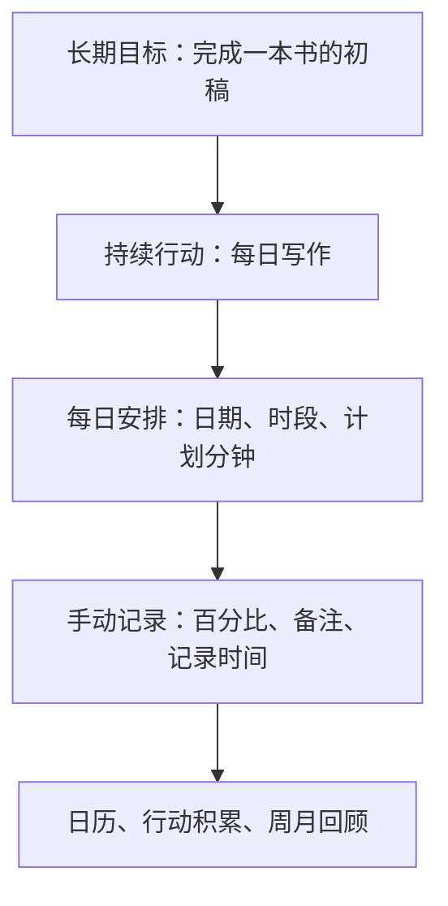
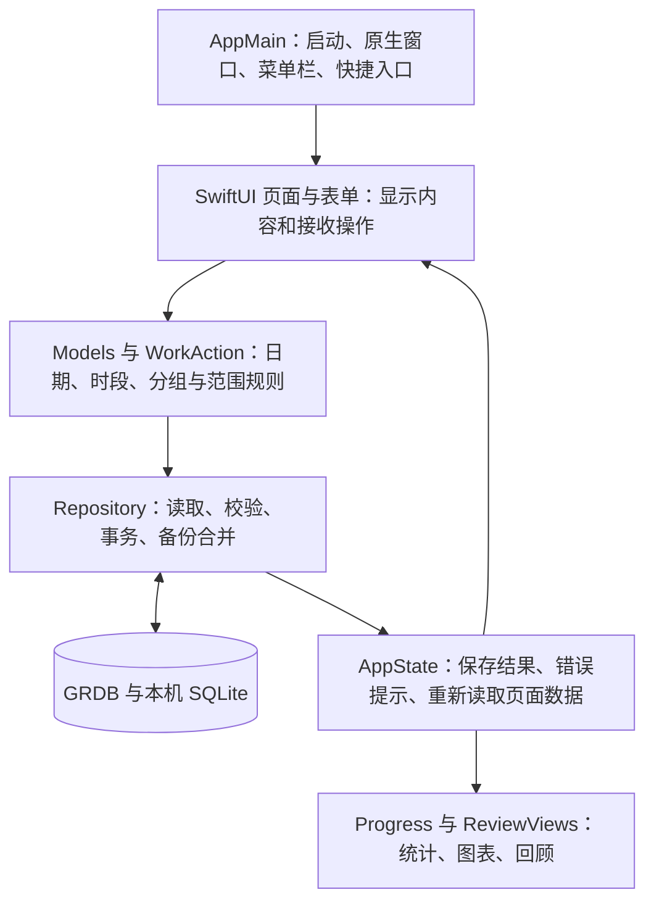

# 时间便签

**中文**　把每天几点到几点的工作安排，变成看得见的长期积累。
**English**　Turn your hourly schedule into visible, long-term progress.
**日本語**　毎日のスケジュールを、目に見える長期的な積み重ねに変える。

**中文**　时间便签是一款开源的 **macOS 原生计划与进展记录软件**。你可以写下长期目标，把它拆成每天要做的工作，手动记录完成程度，再通过日历、趋势和周／月回顾调整计划。

**English**　TimeNote (时间便签) is an open-source **native macOS app for planning and tracking progress**. Write down long-term goals, break them into daily tasks, log how much you complete manually, and adjust your plan through the calendar, trends, and weekly/monthly reviews.

**日本語**　TimeNote（時間メモ）は、オープンソースの **macOS ネイティブの予定・進捗記録アプリ**です。長期目標を書き出し、毎日の作業に分解し、完了度を手動で記録して、カレンダー・トレンド・週次／月次レビューで計画を調整できます。

**中文**　它使用 **Swift + SwiftUI / AppKit** 开发，不是网页外壳。日常安排、记录和回顾不依赖在线服务：**不需要账号，工作、目标和进展保存在本机，没有云同步、遥测或主动上传。**

**English**　It is built with **Swift + SwiftUI / AppKit**, not a web wrapper. Daily planning, logging, and review don't depend on online services: **no account is needed; tasks, goals, and progress are stored locally, with no cloud sync, telemetry, or proactive uploads.**

**日本語**　**Swift + SwiftUI / AppKit** で開発されたネイティブアプリで、Web ベースのラッパーではありません。日々の予定・記録・振り返りはオンラインサービスに依存しません：**アカウントは不要で、作業・目標・進捗はすべてローカルに保存され、クラウド同期・テレメトリ・能動的なアップロードはありません。**

> **中文**　**当前版本：0.1.3 公开预览版。** 它已经可以用于本地安排、记录和回顾，但不是所有功能都完成的稳定版。**严格提醒尚未启用，睡眠或主程序完全退出后的准时持续响铃尚未实现、尚未验证，请不要用它代替重要闹钟。**
>
> 项目通过数据校验、保存前确认、数据库事务和分层测试提高可靠性；这些措施不等于“完美运行”或“永不丢失数据”。已验证范围、已知警告和未完成事项都在下文说明。
>
> **English**　**Current version: 0.1.3 public preview.** It is already usable for local planning, logging, and review, but it is not a stable release with every feature complete. **Strict reminders are not enabled yet; a persistent, on-time alarm after sleep or after the main app has fully quit is neither implemented nor verified. Do not rely on it as a replacement for an important alarm.**
>
> The project improves reliability through data validation, save-time confirmation, database transactions, and layered testing; these measures do not mean "runs perfectly" or "never loses data". The verified scope, known caveats, and outstanding items are described below.
>
> **日本語**　**現在のバージョン：0.1.3 公開プレビュー。** ローカルでの予定・記録・振り返りにはすでに使えますが、すべての機能が完成した安定版ではありません。**厳格なリマインダーはまだ有効化されておらず、スリープ後やメインアプリ完全終了後に時間通り鳴り続けるアラームは未実装・未検証です。大切な目覚ましの代わりには使わないでください。**
>
> このプロジェクトはデータ検証・保存前確認・データベーストランザクション・階層テストによって信頼性を高めていますが、これらは「完璧に動作する」または「データが絶対に失われない」ことを意味するものではありません。検証済みの範囲・既知の注意点・未完了事項はすべて後述します。

[下载 v0.1.3](https://github.com/Keng0nion/timenote/releases/tag/v0.1.3) · [版本说明](RELEASE_NOTES.md) · [问题反馈](https://github.com/Keng0nion/timenote/issues) · [MIT 许可证](LICENSE)

## 目录

- [What TimeNote does](#what-timenote-does)
- [下载与安装](#下载与安装)
- [核心概念与工作原理](#核心概念与工作原理)
- [详细操作指南](#详细操作指南)
- [统计是怎样计算的](#统计是怎样计算的)
- [数据保存与备份原理](#数据保存与备份原理)
- [内部模块如何配合](#内部模块如何配合)
- [使用了哪些技术与工具](#使用了哪些技术与工具)
- [如何保障可靠运行](#如何保障可靠运行)
- [从源码构建与检查](#从源码构建与检查)
- [当前限制与常见问题](#当前限制与常见问题)
- [接下来的改进顺序与 AI 边界](#接下来的改进顺序与-ai-边界)
- [反馈与参与](#反馈与参与)
- [许可证与署名](#许可证与署名)

## What TimeNote does

**中文**　时间便签关注的是：**今天准备做什么、实际完成多少、这些行动怎样积累成长期进展。** 它不自动替你判断目标，也不因为时间到了就把工作标为完成。

**English**　TimeNote is about: **what you plan to do today, how much you actually complete, and how these actions accumulate into long-term progress.** It doesn't judge your goals for you, and it doesn't mark tasks as done just because the time has arrived.

**日本語**　TimeNote が重視するのは、**今日何をする予定か、実際にどれだけ完了したか、それらの行動がどのように長期的な進捗に積み上がるか**です。目標を自動で判断したり、時間になったからといって作業を完了扱いにしたりはしません。

| 中文 | English | 日本語 |
| --- | --- | --- |
| **安排明确时段**：写下日期、开始时间、结束时间，自动算出计划分钟数，支持跨午夜。 | **Schedule explicit time slots**: enter a date, start time, and end time; the planned minutes are calculated automatically, including spans that cross midnight. | **時間枠を明示的に予約**：日付・開始時刻・終了時刻を入力すると計画分数が自動計算され、深夜をまたぐ予定にも対応します。 |
| **安排重复工作**：只做一次、每天、工作日或自选周几，按指定结束日期生成每日安排。 | **Schedule repeating tasks**: once, every day, on weekdays, or on chosen weekdays, generating daily entries up to a specified end date. | **繰り返し作業を予約**：1回だけ・毎日・平日・指定した曜日から選び、指定した終了日まで毎日の予定を生成します。 |
| **保留真实进展**：手动填写 `0–100%` 和备注；每次记录、修正与单步撤销都保留进展历史。 | **Keep an honest record of progress**: fill in `0–100%` and notes manually; every entry, correction, and single-step undo is kept in the progress history. | **正直な進捗を残す**：`0–100%` とメモを手動で入力。記録・修正・1ステップの取り消しもすべて進捗履歴に残ります。 |
| **连接长期目标**：既能为目标新建工作，也能加入已有工作，不复制任务、不重复统计。 | **Connect long-term goals**: create tasks for a goal or attach existing tasks, without duplicating tasks or double-counting. | **長期目標につなげる**：目標のために作業を新規作成することも、既存の作業を追加することもでき、タスクの複製や二重計上はしません。 |
| **把重复工作看成持续行动**：例如 30 天阅读在目标下显示为一项行动，每一天仍独立记录。 | **Treat repeating tasks as an ongoing action**: for example, 30 days of reading appears under a goal as one action, while each day is still recorded independently. | **繰り返し作業を継続的な行動として扱う**：たとえば 30 日間の読書が目標の下で1つの行動として表示され、各日は独立して記録されます。 |
| **回看积累**：日历、完成率趋势、上周分类回顾和上月整体回顾，未记录不会被当作失败。 | **Review your accumulation**: calendar, completion-rate trends, last week's category review, and last month's overall review; unrecorded days are never treated as failures. | **蓄積を振り返る**：カレンダー・達成率トレンド・先週の分類別レビュー・先月の全体レビュー。未記録は失敗として扱われません。 |
| **保护本地资料**：JSON 导出、导入前预览、编号冲突拒绝覆盖。 | **Protect local data**: JSON export, preview before import, and refusal to overwrite on ID conflicts. | **ローカルデータを守る**：JSON エクスポート、インポート前のプレビュー、ID 衝突時の上書き拒否。 |
| **快速打开**：菜单栏入口、应用内快捷键，以及用户自行设置的全局快捷键。 | **Quick access**: menu bar entry, in-app shortcuts, and user-defined global shortcuts. | **すばやく開く**：メニューバーからのエントリ、アプリ内ショートカット、ユーザー設定のグローバルショートカット。 |

**中文**　它目前**不是实际用时计时器、重要闹钟、自动排期助手或多设备同步工具**。

**English**　It is currently **not** an elapsed-time timer, a critical alarm, an auto-scheduling assistant, or a multi-device sync tool.

**日本語**　現在は**実際の所用時間タイマーでも、重要な目覚まし時計でも、自動スケジュール作成ツールでも、マルチデバイス同期ツールでもありません**。

## 下载与安装

### 运行要求

- **芯片**：Apple Silicon，即 M 系列 Mac；当前不支持 Intel。
- **系统**：构建目标为 macOS 14.0 及以上。**实际在 macOS 26.6.2 与 27.0 / Apple Silicon 验证**，不能据此保证其他系统和其他 Mac 正常运行。
- **普通使用者不需要安装开发工具**：下载包已经包含应用、两个第三方运行库和所需资源；不需要另装 Python、Swift、数据库服务器或命令行工具。

### 获取应用

前往 [v0.1.3 macOS Release](https://github.com/Keng0nion/timenote/releases/tag/v0.1.3)，选择一种下载方式：

1. **推荐 DMG**：下载 `TimeNote-0.1.3-macOS-arm64.dmg`，打开后把“时间便签”拖到“应用程序”。
2. **也可 ZIP**：下载 `TimeNote-0.1.3-macOS-arm64.zip`，解压获得相同应用，也可以放在自己选择的文件夹。
3. `SHA256SUMS.txt` 是文件校验清单，用于核对安装包下载是否完整，不是另一份应用。

首次打开是空清单，不注入示例工作，不读取其他软件的数据。本文中的学习、阅读等内容只是操作示例。

**关于 macOS 安全提示：** 当前没有 Apple 开发者签名或公证，只有临时签名。从网上下载后，macOS 可能阻止打开。临时签名不等于 Apple 确认开发者身份或完成安全审核。请保留系统提示并反馈；**不要关闭 Gatekeeper、移除隔离属性或修改系统安全策略来绕过检查。**

### 从旧版升级

1. 在旧版“设置与备份”中导出一份最新 JSON 备份。
2. 保存或取消正在填写的表单，再用 `⌘Q` 完全退出旧应用。
3. 替换应用后打开新版，**不要同时运行两份时间便签**。
4. 核对原有工作、目标与历史仍在；整理目标归属后，再导出一份新的备份。

0.1 / 0.1.0 / 0.1.1 / 0.1.2 换用 0.1.3 时沿用相同数据位置，不需要搬动数据库。0.1.3 没有升级数据库结构或原生 JSON 版本，也不会在升级时擅自整理旧版零散的目标归属。

## 核心概念与工作原理

### 四个概念，分别解决四个问题

- **长期目标 `Goal`**：长期想完成什么，例如“完成一本书的初稿”。目标名称由你填写，软件不自动拆解或排期。
- **持续行动 `WorkAction`**：为了目标反复做什么，例如“每日写作”。它是同一重复安排的汇总展示，**不是额外复制出来的一份任务**。
- **每日安排 `WorkItem`**：具体哪天、几点到几点做，例如“某天 20:00–20:30 写作”。每一天有自己的编号、计划时长、目标归属和当前进度；也可以不属于任何目标。
- **进展记录 `Entry`**：这一次填写了多少百分比、什么备注、何时记录。一次每日安排可以有多条进展历史。



这张图表示使用顺序，不表示每个人都必须先建目标：你也可以先用每日清单，再把已有工作加入目标。

### 重复安排为什么每天独立，却只显示一项行动

创建重复工作时，软件会在指定日期范围内筛选符合规则的日子，**一次性保存已经排出的每日安排**，而不是等到当天才临时生成。每次重复创建都会得到一个共同的 `seriesID`，即“这一组重复安排的编号”。

- 每日清单按日期读取，所以今天和明天各有自己的完成程度。
- 目标页和“加入已有工作”按 `seriesID` 分组，所以 30 天学习和 30 天阅读只显示两项持续行动，不会铺成 60 行日期。
- 分组不只看名称：另建的同名重复安排不会误合并；没有重复组的单次工作按自己的编号独立处理。
- 同组未来工作即使改过名称，仍属于原来的组；搜索旧名称、分类或任一成员日期，匹配的仍是整组。
- 持续行动由现有每日数据计算，没有独立的“行动数据库表”。指定范围以外的未来日期不会自动增加，后来另建的同名系列也不会自动纳入。

### 目标关联为什么不会重复统计

每日安排只保存一个可选的 `goalID`，即“属于哪个目标”。通过归属调整入口加入、换目标或移出时，只修改这个字段：**不复制每日安排，不改日期、时间、进度、备注或进展历史。**

对重复工作，这些入口处理**整组已存在的日期，包括过去、今天和未来**；单次工作只处理自身。先展示原归属、新归属和次数，确认后才保存。修改未来安排则有另一套范围规则，见下文，不能把两种操作混为一谈。

## 详细操作指南

### 1. 熟悉四个页面

左侧导航包含：

- **每日清单**：查看选定日期、新增工作、记录进度、查看历史和调整安排。
- **长期目标**：新增目标、安排工作、加入已有工作、查看持续行动的积累。
- **积累与回顾**：按月份和分类查看日历、趋势与回顾；点击日历某天返回当天清单。
- **设置与备份**：设置快捷键、导入导出、查看数据位置、回顾开关和许可说明。

窗口底部显示保存状态或错误。遇到“保存不可用”或“列表刷新失败”等提示，应先按提示处理，而不是连续重复提交。

### 2. 新增第一项工作

1. 打开“每日清单”，选择日期；可以用左右箭头切换，也可以点“回到今天”。
2. 点“新增工作”，或在应用内按 `⌘N`。
3. 填写名称，例如“阅读一章”；分类可不填，也可填写“学习”。
4. 在“每天几点到几点”填写 24 小时制时间，例如 `20:00` 至 `20:30`。
5. 如果只是做一次，保留“只做一次”；需要时选择已有的归属目标。
6. 核对显示的“计划 30 分钟”，点“保存安排”。

**时间输入规则：** 修改开始时间会尽量平移结束时间，保持上一次有效时长；结束时间也可以单独改。未填完或无效的时段不能保存。跨午夜需要勾选“次日结束”，例如 `23:30` 至次日 `00:45`，计划时长为 75 分钟。

计划分钟只是你准备投入的时间，**不会启动计时，也不会设置系统闹钟**。

### 3. 安排重复工作

新增表单中可选择：

- **每天**：范围内每天安排。
- **工作日**：星期一至星期五；当前不是法定节假日／调休日历。
- **自选周几**：例如只选星期二、星期四和星期六。

然后设置“安排至”的结束日期，核对将保存的次数，再点“保存安排”。一次日期区间最多 366 天。保存后每天分别记录，不会因完成了其中一天就把整组全部完成。

### 4. 记录进展、修正与撤销

- **全部完成**：点工作左侧圆圈，记录为 `100%`。
- **部分完成或明确没完成**：点“未记录／百分比”，或在“…”中选择“记录进展…”，填写 `0–100`；也可使用 `0% / 25% / 50% / 75% / 100%` 按钮，补充备注后点“保存进展”。
- **修正百分比**：重新打开进展表单，填写正确数值。新记录会追加，旧记录仍可查看。
- **查看历史**：在“…”中点“查看历史…”，查看原计划、时区以及历次百分比、备注和时间。
- **撤销刚才的手动记录**：在“…”中点“撤销最后一次手动记录”。软件会追加一条“撤销”，恢复上次记录前的百分比；撤销第一条记录可恢复“未记录”。这不是任意多步回退，最后一条已经是“撤销”时不能继续撤销。

未来日期不能提前填写成绩。到达结束时间不会自动完成；已勾选的工作也不是再次点击就取消完成，应使用修正或撤销入口。

### 5. 修改尚未开始的安排

1. 在工作右侧“…”中选“修改未来安排…”。
2. 调整名称、分类、时段或表单中的归属目标；单次工作也可改日期。
3. 对重复工作，可勾选“同时修改本次及后续尚未开始、没有记录的同组工作”。不勾选则只修改选中这次。
4. 点“查看修改对比”，核对修改前后内容和受影响日期。
5. 点“确认修改”；不合适时点“返回修改”或“取消”。

**已开始或已有进展历史的工作不能修改安排**；即使撤销后恢复为“未记录”，已有历史仍会受到保护。重复系列的日期节奏不会移动，过去和已有记录的安排不会回改。保存时还会重新检查是否已经开始、预览中的数据是否变化。

**注意范围区别：** 这个表单只按所选的未来修改范围保存，包括其中的归属字段。如果想整理整组过去、今天和未来的目标归属，请使用下面的“加入已有工作”或“加入／调整长期目标”入口。

### 6. 创建目标，把已有工作变成持续行动

**先有目标，再安排工作：**

1. 进入“长期目标”，点“新增目标”，填写名称并“保存目标”。
2. 在该目标下点“安排工作”。新表单已带上此目标，填写日期和重复方式即可。

**先有每日工作，再加入目标：**

1. 在目标下点“加入已有工作”。
2. 搜索名称、分类或日期；例如搜索某一天，选中的仍是完整重复组。
3. 选择一项行动，核对原归属、新归属和整组次数。原归属较多时，预览区可以滚动。
4. 点“加入目标”。已整组属于此目标的行动不会重复出现在候选项中；只有部分日期属于此目标时，仍可选整组整理。

**换目标或移出：**

在每日工作“…”中选择“加入长期目标…”或“调整长期目标…”，选择另一个目标，或选择“不属于长期目标”，核对预览后点“保存归属”。移出只解除关联，**不会删除每日工作和进展历史**。

**0.1.1 旧归属怎样处理：** 升级不会自动重写。如果一组中部分日期属于其他目标，目标页会提示关联次数；通过“加入已有工作”确认整组整理后，这些日期也会从原目标移出。只选择但未保存，或按 Esc 取消，都不会改数据。

如果选择期间任何成员新增、删除，或其安排、进度、归属变化，整组保存会拒绝。请取消后重新打开、重新核对，不要试图用旧预览覆盖新记录。

### 7. 查看行动积累和回顾

- **目标内部**：每项行动显示日期范围、时段、截至今天的完成天数和已记录天数。点“每日记录”跳到今天的安排；今天没有安排时，优先跳到之后最近的已安排日期，之后也没有则跳到最后一次安排。
- **月历**：在“积累与回顾”切换月份，或选分类。无计划显示“—”，未来只显示计划，有记录的日子才显示成绩。
- **趋势**：每个点是某天的已知完成率。未记录的日子留空，不画成 `0%`，也不跨缺口假画连续成绩。
- **上周／上月**：页面下方显示上周分类回顾和上月整体回顾，可向下滚动。周一至周日为一周，月度按自然月；这两块始终相对当前日期计算，不随上方月历切换成任意历史周月。
- **显示开关**：在设置中选择是否显示周回顾、月回顾。当前是打开页面按最新数据计算，不是定时生成报告或发送通知，也不是 AI 分析。

### 8. 导出和导入备份

**导出：** 进入“设置与备份”→“导出备份…”，选择保存位置。应用会导出目标、每日安排和进展历史；建议在升级、整理归属或重要修改前后各留一份，不要总覆盖唯一的旧备份。

**导入：** 点“导入备份…”→选择原生 JSON→核对新增工作、新增目标和跳过数量→点“确认合并”。取消预览不会写入数据。

导入是**合并，不是强制恢复覆盖**：完全相同的内容跳过，新编号的内容合并；同编号但内容或历史不同，会整批拒绝，保留现有数据。尤其是整理归属前的旧备份，可能因为目标归属不同而冲突，不能用它覆盖新归属。详细规则见[数据保存与备份原理](#数据保存与备份原理)。

### 9. 快捷入口与安全退出

- 应用内 `⌘N` 新增工作，`⌘,` 打开设置，`⌘W` 关闭窗口；表单可用 Esc 取消。
- 设置中可自行录入“打开时间便签”和“新增工作”的全局快捷键；默认不占用组合，两个入口不能使用相同组合。
- 全局快捷键只在程序运行时有效，跨应用实际按键触发尚未验收。
- **关窗口不等于退出**：菜单栏入口仍在，可选择“打开时间便签”重新显示窗口。
- 完全退出用 `⌘Q` 或菜单栏“退出时间便签”。应用提供的退出动作在检测到附属表单时会提示先保存或取消；这不等于系统强退、断电等情况也能保护未保存输入。

## 统计是怎样计算的

### 计划分钟加权，不是简单平均

一项 90 分钟的工作和一项 30 分钟的工作，对计划完成率的影响不同。算法只计算**已经填写百分比的工作**：

```text
已知完成率 = Σ（已记录工作的计划分钟 × 完成百分比）
           ÷ Σ（已记录工作的计划分钟）

阅读：计划 30 分钟，完成 100%
写作：计划 90 分钟，完成 50%

结果 = (30 × 100 + 90 × 50) ÷ (30 + 90) = 62.5%
```

如果还有一项未记录工作，它的分钟数不会进入上面已知完成率的分母，而会单独计入未记录数量和分钟。因此，**“已记录部分完成率 100%”不代表当天全部计划都完成**，还要看有多少项未记录。

- 明确填写 `0%` 是有效记录，参与加权；未记录是“未知”，不是 `0%`。
- 当天没有任何计划，显示“无计划”；有计划但全部未填写，则没有已知完成率。
- 周／月汇总按范围内每项工作的计划分钟计算，不把每日百分比再简单平均。
- 跨午夜工作归到**开始日**；未来日期不计入历史成绩。
- 计划分钟不是实际计时，百分比也不是对努力、能力或整个长期目标的评分。

算法在 [Progress.swift](Sources/TimeNoteCore/Progress.swift)，包含百分比范围、非有限数值和汇总溢出检查。

### 行动积累按天计数，不拿未来当漏记

目标内部的行动积累只统计截至今天、已经关联到该目标的成员，并按不同日期计数：

- **已安排天数**：范围内有安排的日期数。
- **已记录天数**：当天任一成员填写了百分比，包括 `0%`。
- **完成天数**：当天属于该行动的成员全部为 `100%`，才算完成一天。

例如排了未来 30 天的阅读，今天完成第一次，会积累完成一天，不会把尚未到来的 29 天当成漏记。旧版部分关联尚未整理时，目标页只显示已经关联部分的积累，并提示其占整组的次数。

这套天数统计回答“坚持了多久”；计划分钟加权回答“已记录工作完成到什么程度”。两者用途不同，软件**不据此自动推算整个长期目标完成率**。

## 数据保存与备份原理

### 数据在本机什么位置

正式应用使用系统的应用支持目录：

```text
~/Library/Application Support/TimeNoteNative-v1/
```

主文件为 `timenote.sqlite`。这是本机 SQLite 数据库，不需要启动独立数据库服务器。运行时可能还有 `timenote.sqlite-wal`、`timenote.sqlite-shm` 等辅助文件。

- 在“设置与备份”中点“在 Finder 查看数据”可以定位目录。
- **不要在运行时只复制主文件充当备份**，这可能遗漏尚在辅助文件中的内容；优先使用应用导出。
- 移动应用不会移动记录，删除应用也不会自动清理数据。不要把删除数据目录当作重装步骤。
- 数据库打不开时，应用会报错并禁用保存，不会为了显示空清单而自动清空、替换原文件。

### 数据库怎样组织

[Repository.swift](Sources/TimeNoteNative/Repository.swift) 通过 GRDB 管理三张表：

- `goal`：目标编号和名称。
- `work`：每日安排，包括重复组编号、目标编号、日期、开始时间、计划分钟、时区和当前百分比。
- `entry`：进展历史，包括关联的工作编号、百分比、备注、记录时刻和“记录／撤销”类型。

编号用于区分不同对象，数据库关联约束用于防止记录指向不存在的目标或工作。结构变更由迁移机制管理；**0.1.3 仍沿用 `v1-local-history`，没有新增行动表或静默改写旧归属。**

保存进展时，追加历史和更新当前百分比在同一次数据库事务中完成。“事务”可以理解为**一组操作要么一起成功，要么一起撤回**，避免只存了一半。整组归属调整和备份合并也使用事务。

### JSON 备份包含什么、拒绝什么

原生备份格式为 `timenote-native`，版本 `1`，包含 `goals`、`tasks`、`entries`。导出从同一次数据库读取中收集内容，并以原子写入方式保存文件，降低写到一半留下不完整目标文件的风险。

备份**不包含应用本体、全局快捷键或回顾显示开关**，也不是整个 macOS 用户目录的备份。

导入流程是：

1. **先检查格式和容量**：拒绝不支持的版本、过大文件或无效 JSON。
2. **再检查内容关系**：编号是否合法和重复、百分比和时段是否有效、目标和工作是否存在、工作当前进度是否与最后一条历史一致。
3. **与现有数据比较**：完全一致的内容跳过；新编号的内容合并；同编号有差异则拒绝整批导入。
4. **让你确认预览**：显示新增和跳过数量。
5. **确认时再次校验并整批保存**：避免预览之后的数据变化造成覆盖；中途出错则回滚。

首版导入文件上限为界面所称的 **20MB**，代码实际限制为 `20 × 1024 × 1024` 字节；最多 20000 项工作、2000 个目标、200000 条历史。日期支持 2000–2100 年，单次重复日期区间最多 366 天，单段时长 1–1440 分钟。这些是格式和操作限制，**不是这些规模已经通过压力测试的承诺**。

早期网页 Demo 的 JSON 与原生格式不兼容，请保留原文件，不要改编号或改版本号强行导入。

### 隐私与保管

- 应用没有账号、遥测、主动上传、云同步或在线 AI。
- **数据库和导出 JSON 没有由本软件额外加密**，应像私人文档一样保管；不要上传到公开 Issue 或仓库。
- 如果自行把备份保存到云盘，云盘自身的同步和访问权限不受本软件控制。
- 手动备份、操作系统安全和磁盘健康仍然重要；事务不能代替备份，也不能保证硬盘故障后的恢复。

## 内部模块如何配合

软件把“显示界面”“判断规则”“保存数据”分开，让同一套规则可以用于实际界面和本地数据检查。



图中是主要职责和数据流，不表示每条箭头都对应独立进程或严格单向调用。具体入口如下：

- [AppMain.swift](Sources/TimeNoteNative/AppMain.swift)：应用启动、窗口生命周期、菜单和快捷键连接；正式版数据目录与测试入口在编译时区分。
- [Views.swift](Sources/TimeNoteNative/Views.swift)：每日清单、进展填写、历史查看与各表单入口。
- [AppState.swift](Sources/TimeNoteNative/AppState.swift)：页面状态、保存后刷新、错误提示、系统导入导出对话框。
- [Models.swift](Sources/TimeNoteNative/Models.swift)：日期、时段、重复安排、工作、目标、历史和备份的数据定义与校验。
- [PlanEditor.swift](Sources/TimeNoteNative/PlanEditor.swift)：新增工作，以及未来修改的“先对比、再确认”。
- [WorkAction.swift](Sources/TimeNoteNative/WorkAction.swift)：按重复组汇总、搜索整组、计算行动天数和跳转日期。
- [GoalAssignment.swift](Sources/TimeNoteNative/GoalAssignment.swift)：加入已有工作、调整归属、完整旧归属预览。
- [Repository.swift](Sources/TimeNoteNative/Repository.swift)：数据库迁移、读写、历史、事务、过时预览保护和备份合并。
- [ReviewViews.swift](Sources/TimeNoteNative/ReviewViews.swift)：目标行动列表、日历、趋势和周／月回顾。
- [SettingsView.swift](Sources/TimeNoteNative/SettingsView.swift)：快捷键录入、回顾开关、备份入口和许可说明。
- [Progress.swift](Sources/TimeNoteCore/Progress.swift)：独立的计划分钟加权计算。

## 使用了哪些技术与工具

**“软件运行时使用的技术”和“开发者用来构建、检查、发布的工具”是两回事。** 普通使用者只需要应用包，不必把下面的工具全部安装一遍。

### 应用本身使用的技术

- **Swift 6**：主要编程语言，用来表达工作、进度和保存规则。类型与编译检查可以提前发现一部分错误，但不会自动消除所有运行问题。
- **SwiftUI**：Apple 的原生界面框架，用于清单、表单、导航、浅色／深色显示。页面随状态更新，不需要浏览器引擎。
- **AppKit**：提供 macOS 窗口、菜单栏、应用菜单、键盘入口、文件选择对话框和 Finder 定位等桌面能力，与 SwiftUI 配合。
- **Foundation**：处理日期、日历、时区、文件、UUID 编号与 JSON 编解码等基础工作；例如拒绝不存在的日期和受夏令时影响而不存在的开始时刻。
- **Swift Charts**：Apple 的系统图表框架，绘制按日完成率趋势。图表数据由本机记录计算，不请求在线图表服务。
- **SQLite + [GRDB.swift 7.11.1](https://github.com/groue/GRDB.swift)**：SQLite 是嵌入式本机数据库；GRDB 提供 Swift 读写、迁移、事务和记录映射，减少重复编写底层数据库操作。**已接入，GRDB 使用 MIT 许可。**
- **[KeyboardShortcuts 3.0.1](https://github.com/sindresorhus/KeyboardShortcuts)**：提供全局快捷键录入与注册能力，连接打开窗口和新增工作。**已接入，使用 MIT 许可**；只在程序运行时有效，跨应用实际触发仍待验收。
- **`@AppStorage` / UserDefaults**：系统的少量偏好存储，用于两个回顾显示开关；工作与历史不放在这里，仍进入 SQLite。

### 构建和依赖管理工具

- **Python 3 + [build.py](build.py)**：把本机编译、依赖库编译、测试包和正式 `.app` 打包步骤串起来。脚本不负责安装开发工具。
- **Apple 命令行开发工具、macOS SDK、`xcrun` 和 `swiftc`**：定位已有编译器和系统框架，把 Swift 源码编译为 Apple Silicon 程序。当前使用直接编译，不要求 SwiftPM，也不依赖仓库外的基础源码。
- **[fetch_dependencies.py](fetch_dependencies.py) + [dependencies.json](dependencies.json)**：从两个官方 GitHub 项目下载固定版本源码，核对下载归档的 SHA-256，保存到 `Vendor/`。只解压普通文件和目录，不执行上游脚本；已有匹配缓存时复用，不代表每次重新下载或逐文件校验缓存。
- **[Tools/Icon.swift](Tools/Icon.swift) + `iconutil`**：用本机 AppKit 绘制不同尺寸图标，再生成 macOS 的 `.icns` 图标资源，不需要在线图标服务。

直接编译 KeyboardShortcuts 时，脚本在 `.build-local/` 生成兼容副本：展开 `@Entry`、移除仅供开发预览的 `#Preview`、补充资源包入口。**不改原 `Vendor/` 源码**，保留本地化资源；此适配未经上游确认，也不代表上游完整测试通过。具体见[构建与第三方说明](Resources/第三方说明.txt)。

### 测试、打包与发布工具

- **直接编译的 Swift 检查程序**：在独立测试数据库中核对计划、统计、历史、整组操作、备份和故障回滚，不把真实工作当测试数据。
- **Python 标准库 `unittest`**：运行 [ReleaseChecks.py](Tests/ReleaseChecks.py)，核对公开源码独立性、版本、路径保护、说明和许可证。
- **原生窗口检查程序**：仅在专用测试包中编译，用虚构数据向本程序窗口派发键盘和原生控件操作，检查页面和保存结果。不申请系统辅助功能权限，不等于完整系统级 UI 测试。
- **`codesign`**：给生成的应用和两个动态库作临时签名，并检查签名完整性。**不是 Apple 开发者签名，不是公证，也不是无漏洞证明。**
- **`hdiutil`**：制作、挂载和检查 DMG 磁盘映像，核对用户实际下载得到的应用。
- **SHA-256 与逐字节比较**：检查安装包、包内文件及 GitHub 回下载资产是否与待发布内容一致；一致性不等于功能正确或身份可信。
- **Git + GitHub CLI `gh`**：记录源码版本、推送公开仓库、上传预览 Release，并回下载核对。它们是开发发布工具，不是应用运行依赖。

`build.py app` 只生成 `.app`，**不会自动制作全部 Release 资产、上传 GitHub 或运行云端检查**。DMG、ZIP 发布及回下载验收是另外的发布步骤。

### 哪些工具没有接入

- [Defaults](https://github.com/sindresorhus/Defaults) 只是评估过的候选，**未下载、未接入**；两个回顾开关使用系统存储即可，避免重复增加设置层。
- 没有接入 Sparkle 自动更新、AI 模型、云同步、后台提醒组件或在线分析服务。
- SwiftUI、AppKit、Foundation、Swift Charts 是 Apple 系统框架，不应列成项目另行引入的第三方开源库。

两个已接入的第三方依赖均保留完整 MIT 原文：[GRDB 许可](Resources/GRDB-LICENSE.txt)、[KeyboardShortcuts 许可](Resources/KeyboardShortcuts-LICENSE.txt)，并随应用分发。

## 如何保障可靠运行

### 已实现的保护措施

1. **输入先校验**：名称长度、有效日期、重复范围、时段和百分比在保存前检查；非法数据不会靠界面显示“成功”蒙混过去。
2. **重要修改先确认**：未来安排先显示修改对比，目标归属先显示整组范围，备份先显示合并预览。
3. **保存时再检查一次**：整组归属会在事务内重新读取全部成员，与选择时的快照比较；成员或工作内容变化就拒绝旧预览，避免覆盖较新的安排、进度和归属。
4. **多项写入使用事务**：重复新增、进度与历史写入、未来修改、整组归属和备份合并都避免留下半份更新。
5. **进展历史追加保存**：修正和单步撤销不会抹掉旧进展记录；已开始或已有历史的安排不能随意回改。
6. **错误要说清楚**：数据打不开时保留原文件并禁用保存；写入已成功但刷新失败时明确提示“勿重复提交”，不误报成保存失败。
7. **测试与正式数据分开**：窗口检查只编译进测试包，正式包不包含 `--data-dir` / `--smoke-test` 测试入口。
8. **固定依赖与检查发行内容**：下载固定版本、验证归档、保留许可、映射编译路径、检查解压和挂载后的应用，而不只检查开发目录中的文件。

### 0.1.2 发布时实际完成的验证

以下是 **0.1.2 在本机环境的既有验证结果**，不是每次文档更新都会重新运行，也不代表所有机器、输入和长时间使用都通过。

- **数据检查 117 项通过**：`python3 build.py test`，保留原 74 项并新增 43 项，覆盖时间与重复规则、62.5% 加权、历史追加与撤销、未来保护、备份往返、冲突拒绝、同名不同组、整组加入／换／移出、成员变化和数据库重开等。
- **真实中途故障回滚通过**：测试数据库设置 SQL 触发器，在整组第一项实际写入后中断后续写入，确认所有归属与记录恢复，未留下半组结果；不只是检查保存前能否报错。
- **公开发布检查 5 项通过**：`python3 -B Tests/ReleaseChecks.py`，检查源码独立性、公开版本、编译路径保护、持续行动说明、MIT 双署名和随包许可入口。
- **正式包与测试包构建成功**：`python3 build.py app`、`python3 build.py ui-app`；业务源码使用警告即编译失败的规则。
- **两轮原生窗口检查**：1100×780 浅色、940×690 深色，**每轮 27 个检查点通过、保存 19 张虚构数据截图**。覆盖新增、取消、进度、修改预览、60 次安排归为两项、部分归属、整组加入与换目标、长名称六种旧归属滚动、预览后刷新仍拒绝覆盖新进度，以及重开一致性。
- **发行文件检查通过**：ZIP 解压后、DMG 挂载后的应用严格临时签名检查；29 份包内文件的 SHA-256 与权限核对；主程序和两个动态库的 arm64 架构检查；三份许可证核对。
- **GitHub 回下载核对通过**：ZIP、DMG、校验清单三份资产与上传前逐字节一致，回下载 DMG 再次通过严格完整性检查。

测试源码见 [NativeChecks.swift](Tests/NativeChecks.swift)、[ActionChecks.swift](Tests/ActionChecks.swift)、[NativeUI.swift](Tests/NativeUI.swift) 和 [ReleaseChecks.py](Tests/ReleaseChecks.py)。截图仅用于本地虚构数据检查，不是用户资料。

### 仍然存在的验证边界和警告

- 实际环境为 **macOS 26.6.2 / Apple Silicon / Swift 6.3.3**；macOS 14.0 是编译目标，不是已经实测的最低系统。
- 117 项是直接编译的 Swift 数据检查，**不是标准 XCTest**，也不替代两个依赖的上游完整测试。当前本机的标准 SwiftPM／XCTest 路径存在接口兼容问题，本仓库使用直接编译方案。
- GRDB 直接编译保留两条上游 `Any`／`Sendable` 警告。两轮窗口检查**每轮仍有 9 条 SwiftUI `AttributeGraph` 布局循环警告**；历史检查也出现过系统输入法日志。检查通过不等于日志无警告。
- 本窗口事件检查不能代替完整系统级操作。系统备份文件对话框的完整键鼠流程、全局快捷键跨应用触发尚未验收。
- 文件提供程序可能给工作目录中的 `.app` 自动添加 Finder 元信息，造成严格签名检查异常。因此发布时另做解压／挂载后的严格核验，不能拿普通签名检查代替。
- 其他 Mac／系统版本、跨时区长期使用、长期运行与压力场景，以及睡眠或完全退出后的提醒仍不能作保证。

## 从源码构建与检查

### 准备环境

需要 Apple Silicon Mac、现有 Apple 命令行开发工具与 macOS SDK、能编译 `@State` 属性包装器的工具链与 SDK 组合，以及 Python 3。脚本不会替你安装软件、更改系统设置或申请后台权限。

命令行工具（Swift 6.4）的默认 SDK 把 `@State` 实现为外部宏，但命令行工具不包含其插件，缺少插件时编译会失败。构建前用 `SDKROOT` 指向仍以普通属性包装器实现 `@State` 的 SDK（本机为 `MacOSX26.5.sdk`）。

取得源码后，在仓库根目录依次运行：

```sh
export SDKROOT="/Library/Developer/CommandLineTools/SDKs/MacOSX26.5.sdk"
python3 fetch_dependencies.py
python3 -B Tests/ReleaseChecks.py
python3 build.py test
python3 build.py app
```

每一步的用途：

1. `fetch_dependencies.py`：获取两个已锁定的官方依赖。**这一步可能联网下载源码，但不会上传你的源码或用户数据。**
2. `ReleaseChecks.py`：先检查公开仓库、版本说明、编译路径与许可证。
3. `build.py test`：编译依赖和数据检查程序，在 `.build-local/test-data/` 下新建独立测试目录运行检查，不读取正式工作数据库。
4. `build.py app`：编译正式应用、放入动态库和资源、加入三份许可证、临时签名，输出 `dist/时间便签.app`。

依赖已具备后，构建与检查在本机执行。编译会把源码路径映射为 `/timenote`，避免发布二进制暴露构建者的个人目录。

**注意：自己构建的正式包也读取正常的数据目录，并不是测试沙盒。** 不要把打开正式包当作隔离测试，也不要同时运行旧版和新版。

### 可选检查与图标生成

```sh
python3 build.py ui-app
python3 build.py icon
```

- `ui-app` 输出 `dist/时间便签测试.app`，只构建，不自动开始窗口检查。运行这个专用测试包时必须同时提供 `--data-dir` 和 `--smoke-test`，数据目录必须是绝对路径并保持空清单；建议每轮使用新建的独立空目录，**绝不能指向正式数据目录**。
- 测试包可加 `--dark --small` 检查深色小窗口。窗口检查会打开本软件窗口、写入虚构工作与备份、保存截图，结束后自动退出；不申请系统辅助功能权限，不测试全局快捷键。
- `icon` 使用 `Tools/Icon.swift` 和系统 `iconutil` 重建 `Resources/TimeNote.icns`，会更新仓库内图标文件；普通构建已可使用随源码提供的图标，不必每次重建。

### 目录导航

```text
Sources/
  TimeNoteCore/       计划分钟加权等基础计算
  TimeNoteNative/     macOS 界面、规则、状态和数据库操作
Tests/               数据、窗口与公开发布检查
Resources/           应用信息、图标和第三方许可说明
Tools/               本机图标生成与独立提醒验证工具
build.py             直接编译、测试和应用打包
fetch_dependencies.py  固定版本依赖下载
dependencies.json    依赖版本、下载地址与归档校验值
LICENSE              主项目 MIT 许可证
RELEASE_NOTES.md      版本变化和发布注意事项
```

`Vendor/` 为下载的上游源码，`.build-local/` 为构建和测试产物，`dist/` 为生成应用。这些目录以及数据库、日志、截图和安装包均不进入源码 Git 提交，见 [.gitignore](.gitignore)；供用户下载的发行安装包单独放在 GitHub Release。

## 当前限制与常见问题

### 为什么到了时间没有响铃，也没有自动完成？

目前时间字段用于安排和计算计划时长，不会创建系统闹钟，完成程度也必须手动记录。**睡眠或主程序完全退出后的准时持续响铃尚未实现、未验证**；没有注册后台、登录启动、电源唤醒或申请通知权限，不用普通通知冒充严格闹钟。

### 为什么不能修改以前的时间，或不能把一项工作取消／归档？

已有历史或已开始的安排受到保护，避免事后改动原计划。可以修正进度、追加备注，或使用归属入口调整目标；**取消／归档尚未实现**，不要直接编辑数据库绕过限制。

### 为什么显示高完成率，但还有很多未记录？

完成率只描述已经记录的部分，未记录是未知，不进入已知完成率的分母。请同时查看未记录数量。软件不会把未知当作失败，也不会因此声称整天已经完成。

### 为什么导入旧备份提示冲突？

同一编号已有不同进度、历史或归属时，导入会拒绝覆盖。这是数据保护，不是“自动用旧备份还原”的工具。保留双方文件，不要改编号、删除现有数据库或反复尝试强行合并。

### 能在另一台 Mac 使用吗？可以自动同步或自动更新吗？

可在满足条件的另一台 Mac 安装，并手动导出／导入兼容原生备份；**跨机器使用尚未实际验收，且冲突规则仍然适用**。没有云同步、在线账号或自动更新；更新需要自行下载新版本并按升级步骤操作。

### 目前还有哪些没做？

- 严格提醒与睡眠／完全退出后的持续响铃。
- 取消／归档工作、修改长期目标名称。
- 早期网页 Demo 备份迁移。
- 本地或在线 AI、自动排期、云同步、自动更新。
- 回顾自定义生成日期／时刻和定时通知。
- Intel 支持、Apple 开发者签名与公证，以及跨机器／系统的完整验收。

这些是当前缺失或尚未验证的能力，不代表已经排好发布日期的承诺。最新版本变化以 [Release](https://github.com/Keng0nion/timenote/releases) 和[版本说明](RELEASE_NOTES.md)为准。

## 接下来的改进顺序与 AI 边界

后续先把基础使用做扎实，再加智能功能；**以下是推进顺序，不是这些功能已经交付，也不承诺尚未验证的发布日期**。

1. **先验证提醒可靠性**：清醒发声与手动停止先行，再验证稍后、主程序完全退出、锁屏和开盖接电睡眠。不能以通知、阻止睡眠或醒来补响代替严格要求。独立[提醒验证工具](Tools/AlarmProbe/README.md)已完成无声检查与两次分别授权的清醒声音试验：首次有人工听到与停止记录，但请求至播放接口成功约11秒耗时未定位，最终外部超时；第二次约0.566秒至播放成功观察、正常退出，操作人事后已确认听到，且声音一直重复直到手动停止。本次独立工具的发声、重复到手动停止与正常退出已有证据，但软件时间和事后反馈不是精确第一声测量。第二次未重现长耗时不等于首次问题已修复，准时性和完整提醒链路仍未验收，**第一阶段仍未通过**。后续无声排查确认首次两种计时都记录到长区间，但旧日志缺少分段，仍不能定位原因；验证工具的音频准备会同步占用窗口执行路径，因此保留独立的外部超时保护，不能把回调容差当作第一声保证。工具不在正式应用中运行，不能据此启用正式提醒；没有自动重试。
2. **缩短创建与开始工作的操作**：核对首页、快捷入口和时间默认值，减少重复填写与切页，以实际操作验收；不擅自把开始工作等同于自动完成或推测进度。
3. **完善中断后的继续使用**：确保保存失败、重开和跨日后能清楚知道接着做什么，不丢输入、不改旧历史；未完成工作如何处理不能由系统静默决定。
4. **做好恢复与备份**：不只测JSON算法，还要走通实际导出、保存、重新打开与恢复；冲突和失败不能覆盖现有资料。
5. **再增加适量复盘**：每周分类、每月整体、缺失数据单列；先保证看得懂、不过度打扰，不凭不足的数据下结论。
6. **基础功能与便捷性验收后再接 AI**：支持自动提出排期，以及本地AI通过受控入口调用软件。规则建议、真正的本地模型、可选在线服务分别标明，不能混称。

### AI 可以做什么，哪些仍需确认

**当前没有可调用的AI接口，也没有自动排期实现，请不要直接让模型修改SQLite或JSON来绕过应用校验。** 后续区分“软件请求本地模型生成方案”和“外部本地AI调用软件”两种方向；协议、模型和下载要求尚未选定。

- 排期先展示拟新增／修改的未来安排与差异，由你确认后才保存；不静默改历史、已开始或有进度的工作。
- 软件设置第一阶段仅提供修改建议，不由AI直接代写；开源工具可调用不等于获得任意系统操作权限。
- 模型不可用时如实提示，不偷偷改为在线处理；在线服务需说明发送数据、密钥、费用及隐私后单独启用。
- 接入时再补完整可执行README指导：环境准备、启用／停用、读取示例、需确认的写入示例、错误与取消、重复请求保护及恢复办法。不提前编造API地址、命令或可用模型。

## 反馈与参与

欢迎通过 [Issues](https://github.com/Keng0nion/timenote/issues) 提交问题或操作建议。为了方便复现，请说明：

1. 时间便签版本、macOS 版本和芯片类型。
2. 从哪个页面开始，依次做了什么。
3. 期望结果、实际结果和完整错误提示。
4. 是否能用新建的虚构工作重复出现。

**提交截图前请遮住私人工作内容和个人数据路径；不要公开上传数据库、JSON 备份、凭据或个人计划。** 优先使用虚构内容说明问题。

改进源码时，请同时检查相关数据规则、必要测试和使用说明；不要为了让测试变绿而移除历史保护、跳过导入冲突或弱化提醒的能力边界。

## 许可证与署名

时间便签采用 **[MIT 许可证](LICENSE)**。

**Copyright (c) 2026 Kengo Kubota and Keng0nion**

允许修改、商用与分发（包括闭源版本），但须保留版权与许可声明；软件按原样提供，不作担保。以上中文说明不代替英文许可原文。

应用内“设置与备份 → 时间便签 MIT 许可”可查看完整条款。GRDB.swift 与 KeyboardShortcuts 继续保留各自的原 MIT 全文和版权署名，不由主项目版权声明替代。
